# 🏗️ Architecture Document — Google Photos: AI Memory Context MVP

> **Technical architecture for bridging the gap between human memory and photo retrieval.**

---

## Table of Contents

- [1. Architecture Overview](#1-architecture-overview)
- [2. High-Level System Architecture](#2-high-level-system-architecture)
- [3. Core Components](#3-core-components)
  - [3.1 Client Layer (Google Photos App)](#31-client-layer-google-photos-app)
  - [3.2 API Gateway & Orchestration Layer](#32-api-gateway--orchestration-layer)
  - [3.3 Memory Clustering Engine](#33-memory-clustering-engine)
  - [3.4 NLU (Natural Language Understanding) Pipeline](#34-nlu-natural-language-understanding-pipeline)
  - [3.5 Visual Understanding Pipeline](#35-visual-understanding-pipeline)
  - [3.6 Memory Fusion Engine](#36-memory-fusion-engine)
  - [3.7 Semantic Search & Retrieval Engine](#37-semantic-search--retrieval-engine)
  - [3.8 Notification & Prompt Engine](#38-notification--prompt-engine)
- [4. Data Models & Schema](#4-data-models--schema)
  - [4.1 Memory Context Object](#41-memory-context-object)
  - [4.2 Memory Cluster Object](#42-memory-cluster-object)
  - [4.3 Semantic Index Entry](#43-semantic-index-entry)
  - [4.4 User Preferences](#44-user-preferences)
- [5. API Design](#5-api-design)
- [6. AI/ML Pipeline Architecture](#6-aiml-pipeline-architecture)
  - [6.1 Memory Understanding Pipeline](#61-memory-understanding-pipeline)
  - [6.2 Visual Analysis Pipeline](#62-visual-analysis-pipeline)
  - [6.3 Memory Fusion Pipeline](#63-memory-fusion-pipeline)
  - [6.4 Semantic Search Pipeline](#64-semantic-search-pipeline)
- [7. Data Flow Architecture](#7-data-flow-architecture)
  - [7.1 Memory Capture Flow](#71-memory-capture-flow)
  - [7.2 Memory Retrieval Flow](#72-memory-retrieval-flow)
- [8. Infrastructure & Technology Stack](#8-infrastructure--technology-stack)
- [9. Security & Privacy Architecture](#9-security--privacy-architecture)
- [10. Scalability & Performance](#10-scalability--performance)
- [11. Observability & Monitoring](#11-observability--monitoring)
- [12. Error Handling & Resilience](#12-error-handling--resilience)
- [13. MVP Implementation Phases](#13-mvp-implementation-phases)
- [14. Technical Risks & Mitigations](#14-technical-risks--mitigations)
- [15. Future Architecture Considerations](#15-future-architecture-considerations)

---

## 1. Architecture Overview

### Design Philosophy

The architecture is designed around three core principles derived from the [problem statement](file:///Users/shubhamthakur/Downloads/nextleap%20antigravity%20projects/Google%20Photos%20Project%20/MVP%20google%20photos%20/problemStatement.md):

| Principle | Architectural Implication |
|---|---|
| **Capture memory while it's fresh** | Real-time clustering, intelligent prompt timing, low-latency input processing |
| **AI does the organizational work** | Multi-stage ML pipeline: NLU → Visual Analysis → Fusion → Semantic Indexing |
| **Search by memory, not metadata** | Vector-based semantic search over fused memory embeddings, not just keyword matching |

### System Boundaries

```
┌─────────────────────────────────────────────────────────────────────────┐
│                        GOOGLE PHOTOS ECOSYSTEM                         │
│                                                                         │
│  ┌──────────────┐   ┌──────────────────────────────────────────────┐   │
│  │  EXISTING     │   │         NEW: AI MEMORY CONTEXT SYSTEM       │   │
│  │  GOOGLE       │   │                                              │   │
│  │  PHOTOS       │◄──┤  • Memory Clustering Engine                  │   │
│  │  PLATFORM     │   │  • NLU Pipeline                              │   │
│  │               │──►│  • Visual Understanding Pipeline             │   │
│  │  • Photo      │   │  • Memory Fusion Engine                      │   │
│  │    Storage     │   │  • Semantic Search & Retrieval               │   │
│  │  • Metadata   │   │  • Notification & Prompt Engine              │   │
│  │  • Search     │   │  • Privacy & Control Layer                   │   │
│  │  • Albums     │   │                                              │   │
│  │  • Faces      │   └──────────────────────────────────────────────┘   │
│  └──────────────┘                                                       │
└─────────────────────────────────────────────────────────────────────────┘
```

> [!IMPORTANT]
> The Memory Context system integrates **alongside** the existing Google Photos platform. It does not replace existing search, albums, or metadata — it adds a new semantic layer on top.

---

## 2. High-Level System Architecture

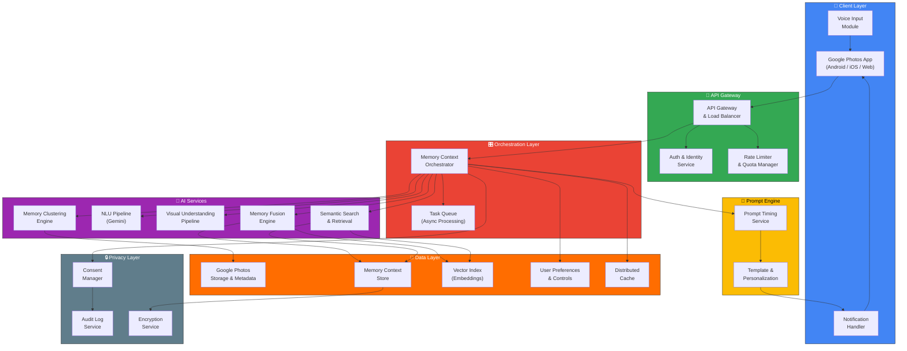

---

## 3. Core Components

### 3.1 Client Layer (Google Photos App)

The client layer extends the existing Google Photos app with new UI surfaces for memory capture and retrieval.

#### Component Breakdown

| Component | Responsibility | Platform |
|---|---|---|
| **Memory Prompt Card** | Displays the "Remember this moment later?" notification within the app | Android, iOS, Web |
| **Memory Input Sheet** | Bottom sheet / modal for text & voice memory input | Android, iOS, Web |
| **Memory Confirmation View** | Shows AI-understood concepts as semantic chips for user review | Android, iOS, Web |
| **Voice Input Module** | Speech-to-text conversion using on-device or cloud STT | Android, iOS |
| **Memory Badge** | Visual indicator on photo clusters that have associated memories | Android, iOS, Web |
| **Enhanced Search Bar** | Extended search supporting natural-language memory queries | Android, iOS, Web |
| **Memory Manager UI** | Settings screen for viewing, editing, and deleting saved memories | Android, iOS, Web |

#### Client Architecture

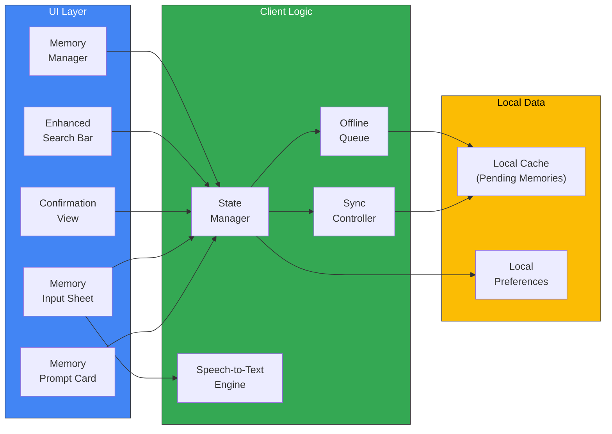

> [!NOTE]
> Voice input is critical for low-friction memory capture. The STT engine should prioritize on-device processing for speed and privacy, with cloud fallback for complex utterances.

---

### 3.2 API Gateway & Orchestration Layer

The gateway handles authentication, rate limiting, and request routing. The orchestrator coordinates the multi-step memory processing pipeline.

#### API Gateway Responsibilities

```
Client Request
     │
     ▼
┌─────────────────────────┐
│     API GATEWAY          │
│                          │
│  1. TLS Termination      │
│  2. Authentication       │
│  3. Authorization        │
│  4. Rate Limiting        │
│  5. Request Validation   │
│  6. Request Routing      │
│  7. Response Caching     │
└─────────────────────────┘
     │
     ▼
  Orchestrator
```

#### Orchestrator — Workflow Engine

The orchestrator manages the lifecycle of memory operations using a **saga pattern** to coordinate distributed services:

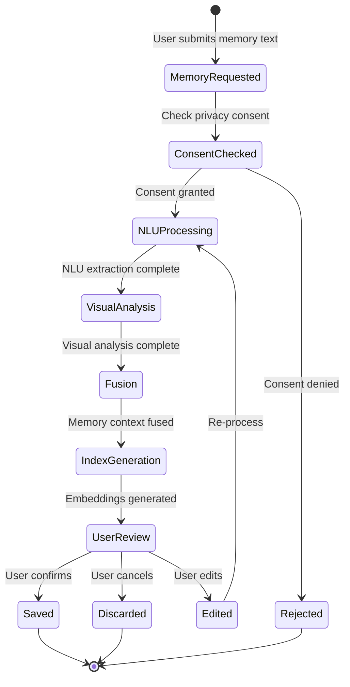

---

### 3.3 Memory Clustering Engine

Identifies groups of photos/videos that likely represent a single event or activity — the "memory cluster" that triggers a prompt.

#### Clustering Signals

| Signal | Weight | Source |
|---|---|---|
| **Temporal proximity** | High | Photo metadata (capture timestamp) |
| **Geospatial proximity** | High | GPS / location metadata |
| **Visual similarity** | Medium | Existing Google Photos visual embeddings |
| **Device continuity** | Low | Same device within a session |
| **Burst detection** | Medium | Rapid succession of captures |
| **Scene consistency** | Medium | Similar scene/environment across photos |

#### Clustering Algorithm

```
Input:  Recent unclustered photos/videos (last 24-48 hours)
Output: List of MemoryCluster objects

Algorithm:
  1. Sort media by capture_timestamp
  2. Apply temporal windowing (gap threshold: configurable, default 2 hours)
  3. Within temporal windows, apply geo-clustering (DBSCAN, ε = 500m)
  4. Merge co-located temporal clusters
  5. Score each cluster for "memory-worthiness":
     - Minimum media count threshold (default: 3)
     - Diversity score (not all identical screenshots)
     - Media type mix (photos + videos score higher)
  6. Filter clusters below worthiness threshold
  7. Rank remaining clusters by recency and score
  8. Return top-N clusters for prompt consideration
```

> [!TIP]
> The clustering engine should run as a **background job** triggered by photo sync events, not on every app open. This keeps the experience ambient rather than intrusive.

---

### 3.4 NLU (Natural Language Understanding) Pipeline

Transforms the user's natural-language memory description into a structured semantic representation.

#### Pipeline Architecture

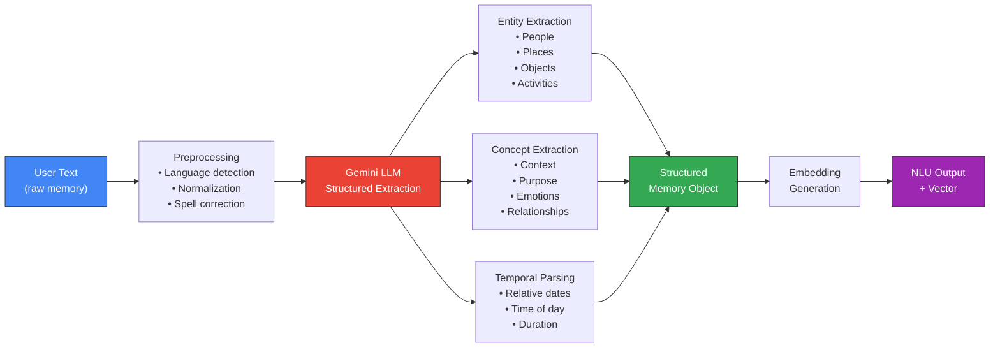

#### Entity & Concept Taxonomy

| Category | Sub-types | Examples |
|---|---|---|
| **People** | Named, Relational, Group | "Ramesh", "my old friend", "family" |
| **Places** | Named, Generic, Relative | "Delhi", "café", "near Rajiv Chowk" |
| **Activities** | Physical, Social, Purpose | "walking", "meeting", "comparing laptops" |
| **Objects** | Food, Products, Documents | "cake", "laptop", "screenshot" |
| **Context** | Emotional, Situational, Temporal | "reunion", "sunny day", "after two years" |
| **Events** | Personal, Recurring, One-time | "first day at office", "birthday party" |
| **Purpose** | Research, Communication, Documentation | "product comparison", "trip planning" |

#### Gemini Prompt Template (Structured Extraction)

```
SYSTEM:
You are a memory understanding assistant for Google Photos.
Extract structured information from the user's natural-language
memory description. Return ONLY information explicitly stated
or directly implied. Never invent facts.

OUTPUT SCHEMA:
{
  "people": [{"name": str, "relationship": str}],
  "places": [{"name": str, "type": str}],
  "activities": [str],
  "objects": [str],
  "context": [str],
  "temporal_refs": [{"reference": str, "parsed": str}],
  "emotions": [str],
  "purpose": str,
  "summary": str,
  "keywords": [str]
}

USER INPUT:
"{user_memory_text}"
```

> [!CAUTION]
> The NLU pipeline must **never hallucinate or invent personal facts**. If the user says "I met a friend", the system must NOT guess the friend's name. Only extract what is explicitly stated or directly inferable.

---

### 3.5 Visual Understanding Pipeline

Analyzes photos and videos in the memory cluster to extract visual entities, scenes, and signals.

#### Pipeline Stages

| Stage | Model/Technique | Output |
|---|---|---|
| **Object Detection** | Gemini Vision / Cloud Vision API | Detected objects with bounding boxes & confidence |
| **Scene Classification** | Scene recognition model | Scene labels (café, park, office, outdoor, etc.) |
| **Face Detection** | Google Face detection (existing) | Detected faces linked to known face groups |
| **Text/OCR** | Cloud Vision OCR | Extracted text from screenshots, signs, documents |
| **Food Detection** | Fine-tuned object model | Food items detected (cake, coffee, etc.) |
| **Activity Recognition** | Video understanding model | Activities in video clips (walking, talking, eating) |
| **Visual Embedding** | CLIP / Gemini multimodal | Dense vector representation per media item |

#### Architecture

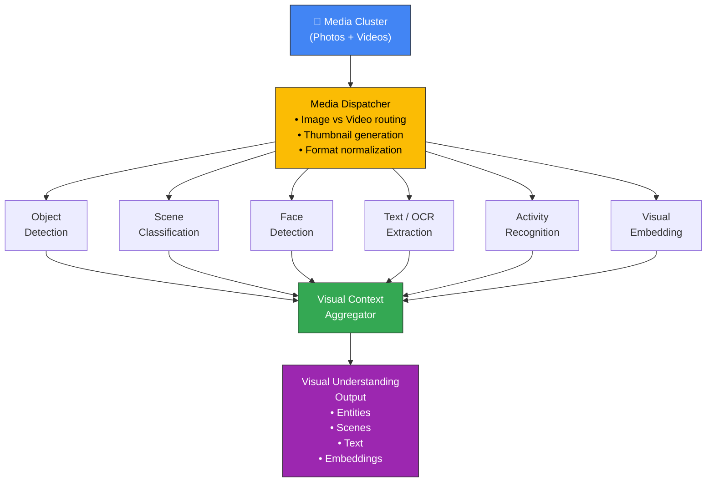

> [!NOTE]
> Many of these visual analysis capabilities **already exist** within Google Photos (face recognition, object detection, scene classification). The architecture should leverage existing pipelines where possible rather than duplicating work.

---

### 3.6 Memory Fusion Engine

The core intelligence component — combines user-provided memory, visual understanding, and existing metadata into a unified **Memory Context Object**.

#### Fusion Strategy

```
┌──────────────────────────────────────────────────────────────────────┐
│                     MEMORY FUSION ENGINE                             │
│                                                                      │
│  ┌─────────────────┐  ┌──────────────────┐  ┌──────────────────┐   │
│  │  USER MEMORY     │  │  VISUAL ANALYSIS  │  │  PHOTO METADATA  │   │
│  │  (Primary)       │  │  (Supporting)     │  │  (Supporting)    │   │
│  │                  │  │                   │  │                  │   │
│  │  • People names  │  │  • Detected faces │  │  • Capture date  │   │
│  │  • Described     │  │  • Detected       │  │  • GPS location  │   │
│  │    places        │  │    objects        │  │  • Device info   │   │
│  │  • Activities    │  │  • Scene labels   │  │  • Album info    │   │
│  │  • Context       │  │  • OCR text       │  │  • Existing tags │   │
│  │  • Purpose       │  │  • Embeddings     │  │                  │   │
│  └────────┬─────────┘  └────────┬──────────┘  └────────┬─────────┘   │
│           │                     │                       │             │
│           └─────────────────────┼───────────────────────┘             │
│                                 │                                     │
│                    ┌────────────▼────────────┐                       │
│                    │    FUSION RULES          │                       │
│                    │                          │                       │
│                    │  1. User context is      │                       │
│                    │     ALWAYS primary       │                       │
│                    │  2. Visual confirms,     │                       │
│                    │     never overrides      │                       │
│                    │  3. Metadata enriches,   │                       │
│                    │     never contradicts    │                       │
│                    │  4. Tag source of each   │                       │
│                    │     concept              │                       │
│                    └────────────┬────────────┘                       │
│                                 │                                     │
│                    ┌────────────▼────────────┐                       │
│                    │  UNIFIED MEMORY CONTEXT  │                       │
│                    │  OBJECT                  │                       │
│                    └─────────────────────────┘                       │
└──────────────────────────────────────────────────────────────────────┘
```

#### Fusion Rules — Priority Hierarchy

| Priority | Source | Rule |
|---|---|---|
| **P0 — Absolute** | User-provided text | Always included. Never overridden. Marked as `source: "user"` |
| **P1 — Confirmatory** | Visual analysis that **confirms** user input | Included as supporting evidence. Marked as `source: "visual_confirmed"` |
| **P2 — Supplementary** | Visual analysis that **adds new** information | Included separately. Marked as `source: "visual_inferred"` |
| **P3 — Enrichment** | Existing metadata (date, location) | Included for indexing. Marked as `source: "metadata"` |

> [!WARNING]
> If visual analysis **contradicts** user input, the user's version takes precedence. The contradiction is logged but **not surfaced** to avoid friction. Example: User says "café", vision detects "restaurant" → use "café" as primary, keep "restaurant" as supplementary.

---

### 3.7 Semantic Search & Retrieval Engine

Enables memory-based search by matching user queries against stored memory contexts using semantic similarity.

#### Search Architecture

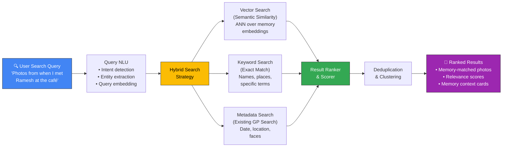

#### Search Strategies

| Strategy | When Used | Technique |
|---|---|---|
| **Semantic Vector Search** | Fuzzy, natural-language queries | Approximate Nearest Neighbor (ANN) over memory embeddings using ScaNN or Vertex AI Matching Engine |
| **Keyword Exact Match** | Queries with proper nouns, specific terms | Inverted index over memory keywords (Ramesh, Delhi, café) |
| **Metadata Fallback** | When memory search has low confidence | Falls back to existing Google Photos search (date, location, face) |
| **Hybrid Fusion** | Default strategy | Combines all three with weighted scoring |

#### Ranking Formula

```
final_score = (α × semantic_similarity)
            + (β × keyword_match_score)
            + (γ × metadata_relevance)
            + (δ × recency_boost)
            + (ε × memory_quality_score)

Where:
  α = 0.45  (semantic similarity weight)
  β = 0.25  (keyword match weight)
  γ = 0.15  (metadata relevance weight)
  δ = 0.10  (recency boost weight)
  ε = 0.05  (memory quality — user-provided vs. auto-generated)
```

---

### 3.8 Notification & Prompt Engine

Manages when and how to prompt users to add memory context. Critical for keeping the experience **calm, non-intrusive, and well-timed**.

#### Prompt Timing Rules

| Rule | Description | Implementation |
|---|---|---|
| **Quiet Hours** | No prompts during sleep hours (user-configurable or inferred) | Time-zone aware scheduling |
| **Cool-down Period** | Minimum gap between prompts (default: 24 hours) | Per-user throttle in preference store |
| **Engagement Window** | Prompt when user is actively browsing photos, not during other tasks | App state detection on client |
| **Memory Freshness** | Prompt same day or next day — not a week later | Cluster age check before prompting |
| **Dismissal Respect** | "Not Now" = try once more (different time). "Don't Ask Again" = permanent opt-out | Preference flag + exponential backoff |
| **Cluster Quality Gate** | Only prompt for clusters above quality threshold | Cluster score filter |

#### Prompt Decision Flow

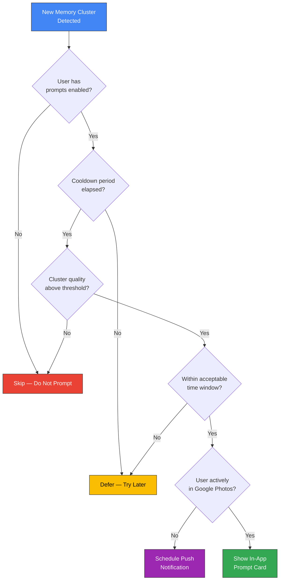

---

## 4. Data Models & Schema

### 4.1 Memory Context Object

The central data structure — represents a user's memory associated with a group of photos/videos.

```json
{
  "memory_id": "mem_a1b2c3d4e5f6",
  "user_id": "user_xyz",
  "cluster_id": "cluster_789",
  "created_at": "2026-03-15T18:30:00Z",
  "updated_at": "2026-03-15T18:35:00Z",
  "status": "active",

  "user_input": {
    "raw_text": "I met my friend Ramesh at a café in Delhi after two years. We talked about our childhood and had cake.",
    "input_method": "voice",
    "language": "en",
    "text_from_stt": true
  },

  "extracted_context": {
    "people": [
      {"name": "Ramesh", "relationship": "friend", "source": "user"}
    ],
    "places": [
      {"name": "Delhi", "type": "city", "source": "user"},
      {"name": "café", "type": "venue", "source": "user"}
    ],
    "activities": [
      {"label": "meeting a friend", "source": "user"},
      {"label": "eating cake", "source": "user"},
      {"label": "talking", "source": "user"}
    ],
    "objects": [
      {"label": "cake", "source": "user"},
      {"label": "coffee cup", "source": "visual_inferred"}
    ],
    "context": [
      {"label": "reunion after two years", "source": "user"},
      {"label": "childhood memories", "source": "user"}
    ],
    "temporal_refs": [
      {"reference": "after two years", "parsed_gap": "P2Y"}
    ],
    "emotions": ["happy", "nostalgic"],
    "purpose": "social",
    "visual_scene": ["indoor_café", "food", "people"],
    "visual_scene_source": "visual_inferred"
  },

  "summary": {
    "short": "Meeting Ramesh at a Delhi café — old friends, childhood memories, cake",
    "keywords": ["Ramesh", "Delhi café", "old friend", "childhood", "cake", "reunion", "two years"]
  },

  "embeddings": {
    "memory_vector": [0.123, -0.456, ...],
    "dimension": 768,
    "model": "text-embedding-005",
    "generated_at": "2026-03-15T18:32:00Z"
  },

  "media_associations": [
    {"media_id": "photo_001", "relevance": 0.95, "specific_concepts": ["Ramesh", "café"]},
    {"media_id": "photo_002", "relevance": 0.88, "specific_concepts": ["cake"]},
    {"media_id": "video_001", "relevance": 0.92, "specific_concepts": ["talking", "café"]}
  ],

  "privacy": {
    "user_consented": true,
    "ai_context_stored": true,
    "source_labels_preserved": true
  }
}
```

### 4.2 Memory Cluster Object

Represents a group of related photos/videos detected by the clustering engine.

```json
{
  "cluster_id": "cluster_789",
  "user_id": "user_xyz",
  "created_at": "2026-03-15T16:00:00Z",
  "status": "pending_prompt",

  "media_items": [
    {"media_id": "photo_001", "type": "photo", "captured_at": "2026-03-15T14:22:00Z"},
    {"media_id": "photo_002", "type": "photo", "captured_at": "2026-03-15T14:25:00Z"},
    {"media_id": "video_001", "type": "video", "captured_at": "2026-03-15T14:30:00Z", "duration_s": 45}
  ],

  "clustering_metadata": {
    "time_span": {"start": "2026-03-15T14:22:00Z", "end": "2026-03-15T15:10:00Z"},
    "location": {"lat": 28.6139, "lng": 77.2090, "locality": "Connaught Place, Delhi"},
    "media_count": {"photos": 10, "videos": 3},
    "quality_score": 0.87,
    "cluster_type": "user_captured"
  },

  "prompt_history": [
    {"prompted_at": "2026-03-15T20:00:00Z", "action": "add_memory", "memory_id": "mem_a1b2c3d4e5f6"}
  ]
}
```

### 4.3 Semantic Index Entry

The searchable index entry generated from a Memory Context Object.

```json
{
  "index_id": "idx_m1n2o3",
  "memory_id": "mem_a1b2c3d4e5f6",
  "user_id": "user_xyz",

  "search_vectors": {
    "primary_embedding": [0.123, -0.456, ...],
    "keyword_tokens": ["ramesh", "delhi", "café", "old friend", "childhood", "cake", "reunion"],
    "entity_index": {
      "people": ["ramesh"],
      "places": ["delhi", "café"],
      "activities": ["meeting", "eating", "talking"]
    }
  },

  "metadata_index": {
    "date_range": {"start": "2026-03-15", "end": "2026-03-15"},
    "location_geo": {"lat": 28.6139, "lng": 77.2090},
    "media_count": 13
  },

  "media_ids": ["photo_001", "photo_002", ..., "video_003"]
}
```

### 4.4 User Preferences

```json
{
  "user_id": "user_xyz",
  "memory_context_settings": {
    "feature_enabled": true,
    "prompts_enabled": true,
    "prompt_frequency": "normal",
    "quiet_hours": {"start": "22:00", "end": "08:00"},
    "ai_context_storage": true,
    "auto_delete_after_days": null,
    "voice_input_enabled": true,
    "prompt_types": {
      "photos_videos": true,
      "screenshots": false,
      "received_images": false
    }
  }
}
```

---

## 5. API Design

### Core API Endpoints

| Method | Endpoint | Description | Auth |
|---|---|---|---|
| `GET` | `/v1/memory/clusters` | List pending memory clusters for the user | OAuth 2.0 |
| `GET` | `/v1/memory/clusters/{cluster_id}` | Get cluster details with media items | OAuth 2.0 |
| `POST` | `/v1/memory/contexts` | Create a new memory context (submit user text) | OAuth 2.0 |
| `GET` | `/v1/memory/contexts/{memory_id}` | Get a saved memory context | OAuth 2.0 |
| `PATCH` | `/v1/memory/contexts/{memory_id}` | Edit a saved memory context | OAuth 2.0 |
| `DELETE` | `/v1/memory/contexts/{memory_id}` | Delete a memory context permanently | OAuth 2.0 |
| `GET` | `/v1/memory/contexts` | List all saved memory contexts for the user | OAuth 2.0 |
| `POST` | `/v1/memory/search` | Search photos using memory-based query | OAuth 2.0 |
| `POST` | `/v1/memory/clusters/{cluster_id}/dismiss` | Dismiss a prompt ("Not Now" / "Don't Ask Again") | OAuth 2.0 |
| `GET` | `/v1/memory/settings` | Get user's memory feature preferences | OAuth 2.0 |
| `PUT` | `/v1/memory/settings` | Update user's memory feature preferences | OAuth 2.0 |

### Key API Flows

#### Create Memory Context — `POST /v1/memory/contexts`

```
Request:
{
  "cluster_id": "cluster_789",
  "user_text": "I met my friend Ramesh at a café...",
  "input_method": "voice"
}

Response (202 Accepted — Processing):
{
  "memory_id": "mem_a1b2c3d4e5f6",
  "status": "processing",
  "estimated_completion_ms": 3000
}

Webhook / Polling → Response (200 OK — Complete):
{
  "memory_id": "mem_a1b2c3d4e5f6",
  "status": "pending_review",
  "summary": "Meeting Ramesh at a Delhi café — old friends, childhood, cake",
  "keywords": ["Ramesh", "Delhi café", "old friend", "childhood", "cake"],
  "media_count": 13,
  "user_provided_concepts": ["Ramesh", "café", "Delhi", "childhood", "cake"],
  "ai_inferred_concepts": ["coffee cup", "indoor setting"]
}
```

#### Memory Search — `POST /v1/memory/search`

```
Request:
{
  "query": "photos from when I met Ramesh at the café",
  "max_results": 50,
  "include_memory_context": true
}

Response:
{
  "results": [
    {
      "media_id": "photo_001",
      "relevance_score": 0.94,
      "matched_memory": {
        "memory_id": "mem_a1b2c3d4e5f6",
        "summary": "Meeting Ramesh at a Delhi café",
        "matched_concepts": ["Ramesh", "café"]
      },
      "media_url": "...",
      "thumbnail_url": "..."
    }
  ],
  "total_results": 13,
  "search_strategy": "hybrid_semantic_keyword"
}
```

---

## 6. AI/ML Pipeline Architecture

### 6.1 Memory Understanding Pipeline

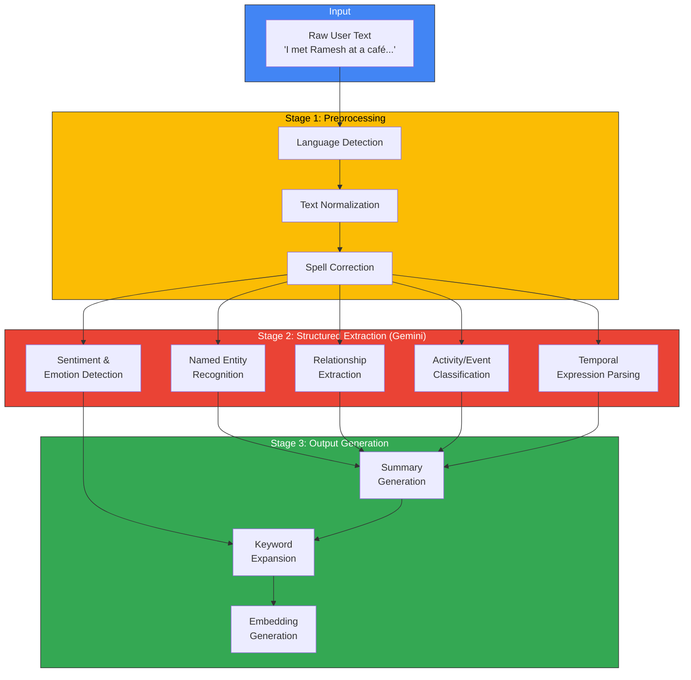

### 6.2 Visual Analysis Pipeline

| Stage | Input | Model | Output | Latency Target |
|---|---|---|---|---|
| **Thumbnail Generation** | Raw media | Image processing lib | Standardized thumbnails | < 100ms |
| **Object Detection** | Thumbnails | Gemini Vision / EfficientDet | Object labels + bounding boxes | < 500ms |
| **Scene Classification** | Thumbnails | Places365 / Custom | Scene labels (café, park, etc.) | < 300ms |
| **Face Linking** | Detected faces | Existing GP face model | Linked face group IDs | < 200ms |
| **OCR Extraction** | Screenshots / text images | Cloud Vision OCR | Extracted text strings | < 400ms |
| **Visual Embedding** | Thumbnails | CLIP / Gemini Multimodal | 768-dim dense vectors | < 500ms |
| **Video Keyframe Extraction** | Video files | FFmpeg + sampling | Representative keyframes | < 1s |

### 6.3 Memory Fusion Pipeline

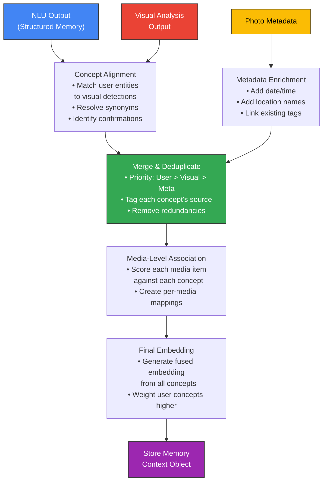

### 6.4 Semantic Search Pipeline

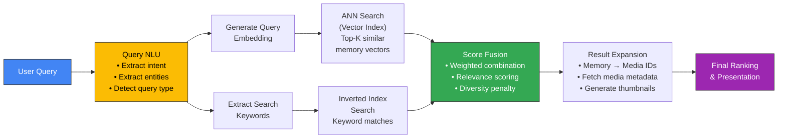

---

## 7. Data Flow Architecture

### 7.1 Memory Capture Flow

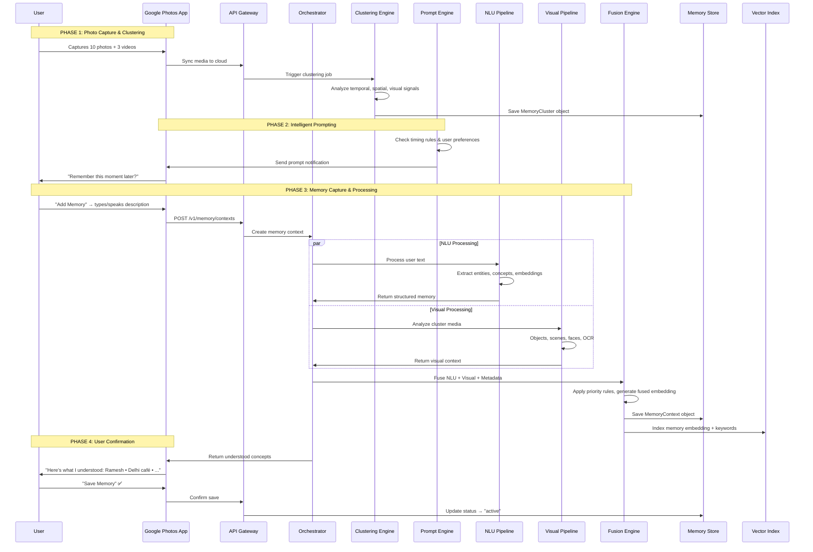

### 7.2 Memory Retrieval Flow

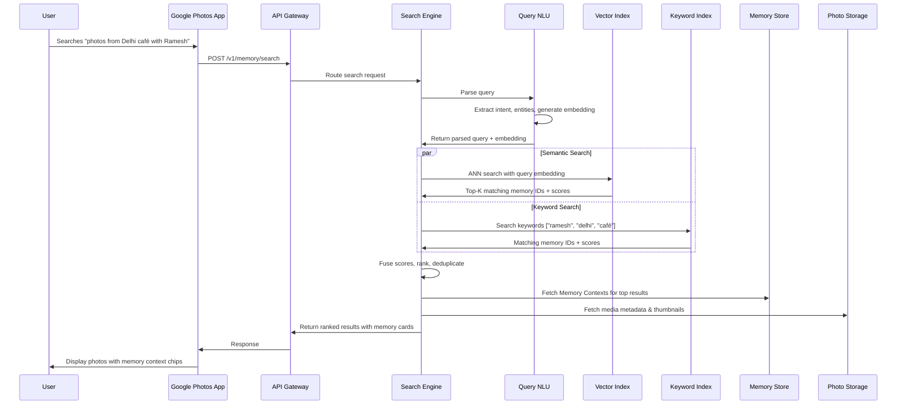

---

## 8. Infrastructure & Technology Stack

### Technology Choices

| Layer | Technology | Rationale |
|---|---|---|
| **Client — Android** | Kotlin + Jetpack Compose | Native performance, modern UI toolkit |
| **Client — iOS** | Swift + SwiftUI | Native performance, platform conventions |
| **Client — Web** | TypeScript + React (or Angular) | Existing Google Photos web stack |
| **API Gateway** | Google Cloud API Gateway / Envoy | Managed gateway with auth, rate limiting |
| **Orchestration** | Cloud Run / GKE + Cloud Tasks | Serverless with async task queuing |
| **NLU Pipeline** | Gemini API (Flash/Pro) | State-of-the-art structured extraction |
| **Visual Pipeline** | Cloud Vision API + Gemini Vision | Leverage existing Google vision stack |
| **Embedding Model** | text-embedding-005 / Gemini embeddings | High-quality semantic embeddings |
| **Vector Index** | Vertex AI Matching Engine / ScaNN | Production-grade ANN search at scale |
| **Keyword Index** | Cloud Spanner / Elasticsearch | Structured keyword search with low latency |
| **Memory Store** | Cloud Spanner | Globally consistent, strongly typed |
| **User Preferences** | Cloud Firestore | Low-latency key-value reads |
| **Cache** | Memorystore (Redis) | Session caching, prompt deduplication |
| **Task Queue** | Cloud Tasks / Pub/Sub | Async job orchestration |
| **Speech-to-Text** | Cloud Speech-to-Text / on-device | Voice input transcription |
| **Monitoring** | Cloud Monitoring + Cloud Trace | Full observability stack |
| **Privacy/Audit** | Cloud Audit Logs + DLP API | Compliance and audit trail |

### Infrastructure Diagram

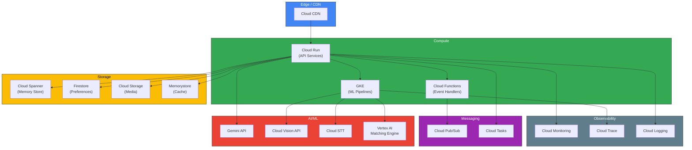

---

## 9. Security & Privacy Architecture

### Privacy-by-Design Principles

| Principle | Implementation |
|---|---|
| **Data Minimization** | Only store extracted concepts, not raw model outputs. Discard intermediate processing artifacts. |
| **Purpose Limitation** | Memory context is used exclusively for photo search/retrieval — not for ads, profiling, or cross-product sharing. |
| **User Control** | Every piece of stored context is viewable, editable, and deletable by the user. |
| **Source Transparency** | Every concept is tagged with its source (`user`, `visual_inferred`, `metadata`) so users know what AI added. |
| **Consent-First** | Feature is opt-in. No data is processed without explicit consent. |
| **Right to Delete** | Deleting a memory permanently removes all associated context, embeddings, and index entries. |

### Encryption Architecture

```
┌─────────────────────────────────────────────────────────────────┐
│                    ENCRYPTION LAYERS                             │
│                                                                  │
│  ┌─────────────────────────────────────────────────────┐        │
│  │  IN TRANSIT                                          │        │
│  │  • TLS 1.3 for all API communication                │        │
│  │  • mTLS between internal services                    │        │
│  │  • Certificate pinning on mobile clients             │        │
│  └─────────────────────────────────────────────────────┘        │
│                                                                  │
│  ┌─────────────────────────────────────────────────────┐        │
│  │  AT REST                                             │        │
│  │  • AES-256 encryption for Memory Store               │        │
│  │  • Per-user encryption keys (CMEK where applicable)  │        │
│  │  • Encrypted vector indices                          │        │
│  │  • Encrypted audit logs                              │        │
│  └─────────────────────────────────────────────────────┘        │
│                                                                  │
│  ┌─────────────────────────────────────────────────────┐        │
│  │  IN PROCESSING                                       │        │
│  │  • Memory content processed in isolated environments │        │
│  │  • No cross-user data leakage in ML pipelines        │        │
│  │  • Ephemeral processing — intermediate data purged   │        │
│  └─────────────────────────────────────────────────────┘        │
└─────────────────────────────────────────────────────────────────┘
```

### Data Lifecycle

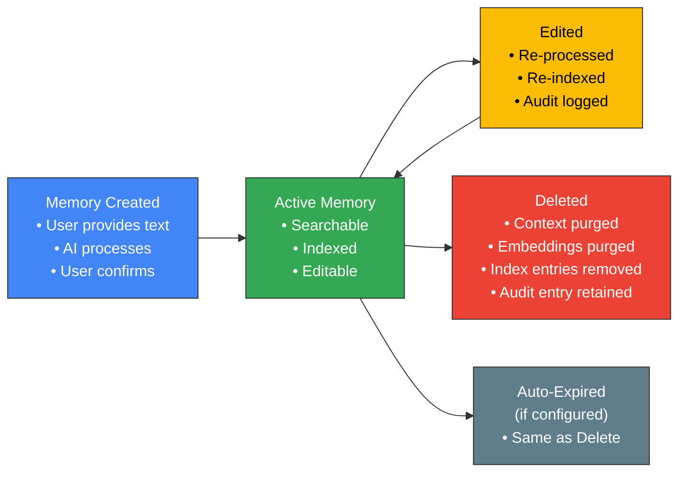

---

## 10. Scalability & Performance

### Performance Targets

| Operation | Target Latency | Scale |
|---|---|---|
| **Cluster Detection** | < 5s (background) | Millions of users syncing daily |
| **Prompt Decision** | < 200ms | Per-user, per-cluster |
| **NLU Processing** | < 2s | Per memory submission |
| **Visual Analysis** | < 5s (async, per cluster) | 3–30 media items per cluster |
| **Memory Fusion** | < 1s | Per memory submission |
| **Embedding Generation** | < 500ms | Per memory |
| **Memory Search (E2E)** | < 500ms (p95) | Per query, over millions of memories per user |
| **Save Confirmation** | < 300ms | After user confirms |

### Scaling Strategy

| Component | Strategy |
|---|---|
| **API Gateway** | Horizontal auto-scaling via Cloud Run |
| **NLU Pipeline** | Gemini API with provisioned throughput + request batching |
| **Visual Pipeline** | Batch processing via GKE autoscaler, process cluster as a unit |
| **Vector Index** | Vertex AI Matching Engine with auto-scaling shards |
| **Memory Store** | Cloud Spanner with regional replication |
| **Cache** | Redis cluster with read replicas |

### Caching Strategy

| Cache Layer | Data | TTL | Eviction |
|---|---|---|---|
| **Client-side** | Recent memory summaries, prompt state | 1 hour | On app refresh |
| **API Gateway** | User preferences, feature flags | 5 minutes | On settings change |
| **Service Layer** | Cluster metadata, memory objects | 15 minutes | LRU |
| **Search Layer** | Recent query results | 10 minutes | LRU + invalidation on memory save |

---

## 11. Observability & Monitoring

### Key Metrics Dashboard

| Metric Category | Metrics | Alert Threshold |
|---|---|---|
| **Adoption** | Feature opt-in rate, daily active memory users | — |
| **Engagement** | Prompt acceptance rate, memories saved per user per week | Acceptance rate < 5% |
| **AI Quality** | NLU extraction accuracy, user edit rate after AI summary | Edit rate > 40% |
| **Search Quality** | Memory-search click-through rate, zero-result rate | Zero-result > 20% |
| **Latency** | E2E memory save latency, search latency (p50, p95, p99) | p95 > SLO |
| **Errors** | Pipeline failure rate, API error rate | Error rate > 1% |
| **Privacy** | Consent check failures, unauthorized access attempts | Any failure |

### Logging Strategy

```
┌───────────────────────────────────────────────────────────┐
│                    LOGGING TIERS                           │
│                                                           │
│  TIER 1 — ALWAYS LOG (Structured)                         │
│  • API request/response (minus PII)                       │
│  • Pipeline stage transitions                             │
│  • Error events with stack traces                         │
│  • Privacy consent checks                                 │
│  • Memory lifecycle events (create, edit, delete)         │
│                                                           │
│  TIER 2 — SAMPLED (10%)                                   │
│  • NLU extraction details                                 │
│  • Visual analysis results                                │
│  • Search ranking scores                                  │
│  • Embedding generation metadata                          │
│                                                           │
│  TIER 3 — DEBUG ONLY                                      │
│  • Raw model inputs/outputs (never in production)         │
│  • Full embedding vectors                                 │
│  • Internal scoring details                               │
└───────────────────────────────────────────────────────────┘
```

> [!CAUTION]
> **Never log raw user memory text in production logs.** Log only anonymized/hashed identifiers. User text is stored only in the encrypted Memory Store.

---

## 12. Error Handling & Resilience

### Failure Modes & Recovery

| Failure Scenario | Impact | Recovery Strategy |
|---|---|---|
| **NLU Pipeline timeout** | Memory processing delayed | Retry with exponential backoff (3 retries, max 30s). If failed, save raw text and process async later. |
| **Visual Pipeline failure** | No visual enrichment | Save memory with user text only. Visual analysis retried in next background job cycle. |
| **Vector Index unavailable** | Search degraded | Fall back to keyword-only search. Alert ops team. |
| **Memory Store write failure** | Memory not saved | Return error to client with "retry" option. Client caches pending memory in local storage. |
| **Gemini API quota exceeded** | Processing blocked | Queue requests with priority ordering. Use cached/batched processing. |
| **Prompt delivery failure** | User not prompted | Re-schedule prompt for next eligible window. Cluster remains in "pending_prompt" state. |

### Circuit Breaker Pattern

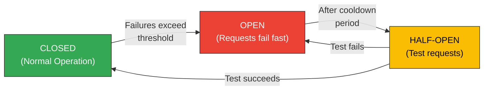

Applied to: Gemini API calls, Visual Pipeline calls, Vector Index queries.

---

## 13. MVP Implementation Phases

### Phase 1 — Foundation (Weeks 1–4)

| Task | Description | Dependencies |
|---|---|---|
| Data model finalization | Finalize Memory Context, Cluster, and Index schemas | — |
| Memory Store setup | Provision Cloud Spanner, define tables | Data model |
| API scaffolding | Implement API endpoints with stubs | Memory Store |
| User preferences | Settings storage and feature flags | API scaffolding |
| Privacy framework | Consent manager, audit logging, encryption | Memory Store |

### Phase 2 — Clustering & Prompting (Weeks 3–6)

| Task | Description | Dependencies |
|---|---|---|
| Clustering engine | Temporal + spatial clustering algorithm | Photo metadata access |
| Cluster quality scoring | Worthiness scoring for prompt eligibility | Clustering engine |
| Prompt timing engine | Rule-based prompt scheduling | User preferences |
| Client prompt UI | Notification card + bottom sheet | API endpoints |
| Voice input integration | STT integration for voice memory input | Client prompt UI |

### Phase 3 — AI Pipelines (Weeks 5–8)

| Task | Description | Dependencies |
|---|---|---|
| NLU pipeline | Gemini-based structured extraction | API endpoints |
| Visual analysis integration | Leverage existing GP vision + custom models | Clustering engine |
| Memory fusion engine | Combine NLU + Visual + Metadata | NLU pipeline, Visual analysis |
| Embedding generation | Memory embedding creation + indexing | Memory fusion |
| Confirmation UI | AI summary review with semantic chips | NLU pipeline |

### Phase 4 — Search & Retrieval (Weeks 7–10)

| Task | Description | Dependencies |
|---|---|---|
| Vector index setup | Vertex AI Matching Engine deployment | Embedding generation |
| Query NLU | Search query understanding pipeline | NLU pipeline |
| Hybrid search implementation | Vector + keyword + metadata fusion | Vector index, keyword index |
| Search ranking | Score fusion and result ranking | Hybrid search |
| Search results UI | Memory-aware search results display | Search ranking |

### Phase 5 — Polish & Launch (Weeks 9–12)

| Task | Description | Dependencies |
|---|---|---|
| End-to-end testing | Full flow testing across platforms | All phases |
| Performance optimization | Latency tuning, caching, batching | All phases |
| Memory management UI | View, edit, delete saved memories | API endpoints |
| A/B testing framework | Experiment setup for prompt strategies | Prompt engine |
| Dogfooding & iteration | Internal testing and feedback cycles | E2E testing |

### Gantt Overview

```
Week:  1    2    3    4    5    6    7    8    9    10   11   12
       ├────┼────┼────┼────┼────┼────┼────┼────┼────┼────┼────┤
Phase 1 ██████████████████
Phase 2      ████████████████████
Phase 3                ████████████████████
Phase 4                          ████████████████████
Phase 5                                    ████████████████████
```

---

## 14. Technical Risks & Mitigations

| # | Risk | Severity | Likelihood | Mitigation |
|---|---|---|---|---|
| 1 | **NLU extraction quality too low** — AI misunderstands user memories | High | Medium | Fine-tune prompts with diverse examples. Allow user edits. Track edit rate as quality signal. |
| 2 | **Search relevance poor** — Memory-based queries return wrong photos | High | Medium | Hybrid search with fallback strategies. A/B test ranking weights. Build evaluation dataset. |
| 3 | **Prompt fatigue** — Users annoyed by too many prompts | Medium | High | Conservative default frequency. Smart timing. Easy permanent opt-out. Monitor dismissal rates. |
| 4 | **Privacy concerns** — Users uncomfortable with AI analyzing personal memories | High | Medium | Full transparency of AI vs. user content. Easy delete. Clear privacy controls. No data used for other purposes. |
| 5 | **Latency too high** — Memory processing takes too long | Medium | Low | Async processing with optimistic UI. Pre-compute visual analysis on sync. Cache embeddings. |
| 6 | **Low adoption** — Users don't engage with the feature | High | Medium | Minimize friction (voice input). Show clear value (successful retrievals). Personalize prompt messaging. |
| 7 | **Embedding drift** — Model updates change embedding space | Medium | Low | Version embeddings. Re-index strategy for model updates. Backward-compatible search. |
| 8 | **Multi-language support** — Users input memories in different languages | Medium | Medium | Gemini supports multilingual NLU. Test with top-10 languages. Language-agnostic embeddings. |

---

## 15. Future Architecture Considerations

### P1 Extensions

| Feature | Architectural Change |
|---|---|
| **Screenshot & document context** | New clustering rules for non-camera media. OCR-heavy visual pipeline. Longer accumulation windows before prompting. |
| **Memory editing & enrichment** | Re-processing pipeline for edited memories. Differential re-indexing. |
| **Cross-device memory sync** | Multi-device state sync via Cloud Firestore. Conflict resolution for memories created on different devices. |

### P2 / Future Vision

| Feature | Architectural Change |
|---|---|
| **Automatic memory generation** | On-device summarization of photo clusters without user input. Lower-confidence memories marked as "auto-generated". User confirmation required before indexing. |
| **Conversational memory search** | Multi-turn dialog for memory retrieval. Gemini-powered conversational agent. Context-carrying search sessions. |
| **Cross-app signals** | Integration with Calendar, Maps, Gmail (with explicit permission). Richer context from multi-source signals. Federated consent management. |
| **Shared memories** | Multi-user memory objects. Shared photo groups with collaborative context. Privacy-preserving shared embeddings. |
| **Memory timeline** | Chronological visualization of memories. Narrative generation across related memories. "Memory stories" auto-compilation. |

### Architecture Evolution Path

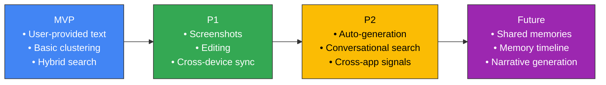

---

> [!IMPORTANT]
> This architecture is designed to be **incrementally buildable** — each component can be developed, tested, and deployed independently. The MVP focuses on the critical path: **Cluster → Prompt → Capture → Understand → Index → Search**. Everything else is additive.

---

*Architecture document for Google Photos — AI Memory Context MVP. Derived from the [Problem Statement](file:///Users/shubhamthakur/Downloads/nextleap%20antigravity%20projects/Google%20Photos%20Project%20/MVP%20google%20photos%20/problemStatement.md).*
