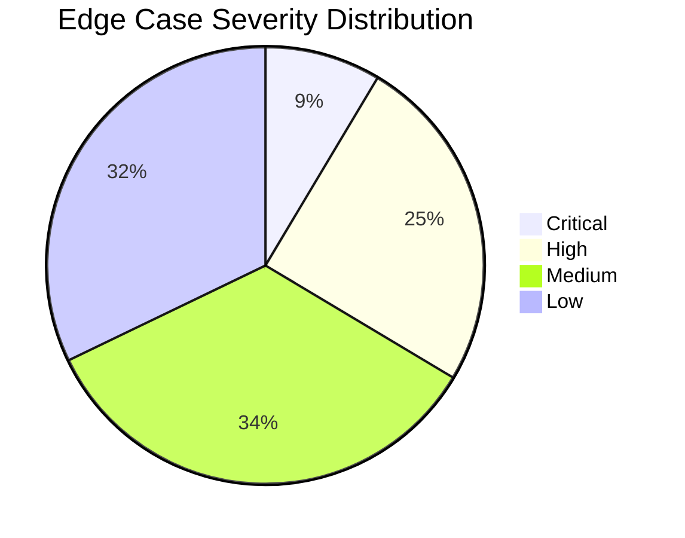

# ⚠️ Edge Cases & Failure Scenarios — Google Photos: AI Memory Context MVP

> **A comprehensive catalog of edge cases, boundary conditions, failure modes, and their expected handling across every component of the system.**

---

## Table of Contents

- [1. User Input Edge Cases](#1-user-input-edge-cases)
  - [1.1 Text Input Anomalies](#11-text-input-anomalies)
  - [1.2 Voice Input Anomalies](#12-voice-input-anomalies)
  - [1.3 Language & Encoding](#13-language--encoding)
  - [1.4 Sensitive & Harmful Content](#14-sensitive--harmful-content)
- [2. Memory Clustering Edge Cases](#2-memory-clustering-edge-cases)
  - [2.1 Cluster Boundary Problems](#21-cluster-boundary-problems)
  - [2.2 Media Type Ambiguities](#22-media-type-ambiguities)
  - [2.3 Metadata Issues](#23-metadata-issues)
- [3. NLU Pipeline Edge Cases](#3-nlu-pipeline-edge-cases)
  - [3.1 Extraction Failures](#31-extraction-failures)
  - [3.2 Ambiguity & Vagueness](#32-ambiguity--vagueness)
  - [3.3 Hallucination Scenarios](#33-hallucination-scenarios)
  - [3.4 Complex Linguistic Patterns](#34-complex-linguistic-patterns)
- [4. Visual Analysis Edge Cases](#4-visual-analysis-edge-cases)
  - [4.1 Image Quality Issues](#41-image-quality-issues)
  - [4.2 Content Misclassification](#42-content-misclassification)
  - [4.3 Video-Specific Issues](#43-video-specific-issues)
- [5. Memory Fusion Edge Cases](#5-memory-fusion-edge-cases)
  - [5.1 Contradiction Handling](#51-contradiction-handling)
  - [5.2 Association Mismatches](#52-association-mismatches)
  - [5.3 Source Attribution Problems](#53-source-attribution-problems)
- [6. Search & Retrieval Edge Cases](#6-search--retrieval-edge-cases)
  - [6.1 Query Ambiguity](#61-query-ambiguity)
  - [6.2 Zero-Result Scenarios](#62-zero-result-scenarios)
  - [6.3 Relevance Failures](#63-relevance-failures)
  - [6.4 Scale & Performance Edge Cases](#64-scale--performance-edge-cases)
- [7. Prompt & Notification Edge Cases](#7-prompt--notification-edge-cases)
  - [7.1 Timing Issues](#71-timing-issues)
  - [7.2 User State Conflicts](#72-user-state-conflicts)
  - [7.3 Notification Delivery Failures](#73-notification-delivery-failures)
- [8. Privacy & Security Edge Cases](#8-privacy--security-edge-cases)
  - [8.1 Consent Edge Cases](#81-consent-edge-cases)
  - [8.2 Data Deletion Edge Cases](#82-data-deletion-edge-cases)
  - [8.3 Access Control Violations](#83-access-control-violations)
- [9. Client & Platform Edge Cases](#9-client--platform-edge-cases)
  - [9.1 Offline & Connectivity Issues](#91-offline--connectivity-issues)
  - [9.2 Multi-Device Conflicts](#92-multi-device-conflicts)
  - [9.3 App Lifecycle Issues](#93-app-lifecycle-issues)
- [10. Infrastructure & System Edge Cases](#10-infrastructure--system-edge-cases)
  - [10.1 Service Failures](#101-service-failures)
  - [10.2 Data Consistency Issues](#102-data-consistency-issues)
  - [10.3 Capacity & Quota Issues](#103-capacity--quota-issues)
- [11. User Behavior Edge Cases](#11-user-behavior-edge-cases)
  - [11.1 Adversarial Usage](#111-adversarial-usage)
  - [11.2 Unusual Usage Patterns](#112-unusual-usage-patterns)
  - [11.3 Account Lifecycle Events](#113-account-lifecycle-events)
- [Edge Case Severity Matrix](#edge-case-severity-matrix)
- [Testing Coverage Map](#testing-coverage-map)

---

## 1. User Input Edge Cases

### 1.1 Text Input Anomalies

| # | Edge Case | Scenario | Expected Behavior | Severity |
|---|---|---|---|---|
| EC-1.1.1 | **Empty text submission** | User opens input sheet, submits with no text (or whitespace only) | Client-side validation prevents submission. Show inline error: "Please describe your memory to continue." Submission blocked. | Low |
| EC-1.1.2 | **Extremely short text** | User types: "fun" or "ok" or "nice" | Accept the input. NLU extracts minimal context (mood/emotion only). Summary shows the limited context. Inform user: "Tip: adding names, places, or activities helps you find these photos later." | Medium |
| EC-1.1.3 | **Extremely long text** | User writes a 5000+ character essay about the memory | Client enforces max character limit (default: 2000 chars). Characters beyond limit are truncated with warning. NLU processes the truncated text. | Low |
| EC-1.1.4 | **Text with only emojis** | User types: "🎂🎉👫☕" | NLU attempts to interpret emojis as semantic signals (cake, celebration, friends, coffee). If no meaningful extraction possible, prompt user: "Could you describe this in a few words?" | Low |
| EC-1.1.5 | **Text with special characters / code** | User pastes code snippets, URLs, or HTML markup | Input sanitization strips dangerous characters. Preserve meaningful URLs (might be contextual). Treat code-like input as generic text. | Low |
| EC-1.1.6 | **Copy-pasted unrelated text** | User accidentally pastes clipboard content unrelated to photos | NLU processes it normally. The confirmation screen will show the mismatched concepts. User can tap "Edit" to correct. No automatic detection of "wrong input." | Low |
| EC-1.1.7 | **Repeated submission of same text** | User submits the exact same memory text for two different clusters | Each submission creates a separate MemoryContext object. NLU results are cached (same hash), so no duplicate Gemini API call. Both clusters get their own memory. | Low |
| EC-1.1.8 | **Text with personal identifiers** | User includes phone numbers, addresses, email addresses, Aadhaar/SSN | NLU should NOT index these as searchable keywords. DLP (Data Loss Prevention) scan detects PII patterns. PII is stored in the raw text but excluded from keywords and search index. Alert: "We detected personal information. It won't be used for search indexing." | High |
| EC-1.1.9 | **Text contradicting visible photo content** | User writes "Beautiful sunset at the beach" for photos clearly taken indoors at an office | User's text takes priority per fusion rules. Visual analysis tags "indoor" and "office" as `visual_inferred`. Both are stored, but user's description is primary for search. No error shown — user may be referring to what happened around the photos, not what's in them. | Medium |
| EC-1.1.10 | **Text with hypothetical/future tense** | User writes "This is where we plan to go next year" or "I wish I could visit here again" | NLU should extract the intent and tag temporal references as future/hypothetical. Keywords still extracted (place names, activities). Memory is valid — captures the user's association. | Low |

### 1.2 Voice Input Anomalies

| # | Edge Case | Scenario | Expected Behavior | Severity |
|---|---|---|---|---|
| EC-1.2.1 | **Background noise during voice input** | User speaks in a noisy environment — café, street, public transport | STT returns low-confidence transcription. Show transcribed text with a warning: "We had trouble hearing clearly. Please review and edit if needed." Allow text editing. | Medium |
| EC-1.2.2 | **Voice input in unsupported language** | User speaks in a language not supported by the STT model | STT returns garbled/empty text. Show error: "We couldn't understand that language. Please try typing instead." Fall back to text input. | Medium |
| EC-1.2.3 | **Voice input cut off mid-sentence** | User's voice cuts off due to timeout or interruption | Save partial transcription. Show what was captured. User can: continue speaking (append), edit text, or re-record. | Low |
| EC-1.2.4 | **Prolonged silence** | User taps mic but doesn't speak for 10+ seconds | Auto-stop after configurable silence threshold (default: 5s). Show: "No speech detected. Tap to try again." | Low |
| EC-1.2.5 | **Code-switching (multilingual speech)** | User says: "We went to the café, bahut maza aaya, and then we walked to Rajiv Chowk" (English + Hindi mix) | STT should handle code-switching where possible. If mixed transcription is partial, accept whatever is captured. NLU (Gemini) handles multilingual input well. | Medium |
| EC-1.2.6 | **Homophones and misrecognition** | STT transcribes "Ramesh" as "Ram mesh" or "café" as "coffee" | Show transcribed text for user review. NLU may still extract the correct intent. User can edit before submitting. | Medium |
| EC-1.2.7 | **Voice input with music/media playing** | User has music or a video playing while recording voice | STT may pick up lyrics/dialog. Transcription will be noisy. Same handling as EC-1.2.1 — low confidence warning + edit option. | Low |

### 1.3 Language & Encoding

| # | Edge Case | Scenario | Expected Behavior | Severity |
|---|---|---|---|---|
| EC-1.3.1 | **Non-Latin scripts** | User writes in Devanagari, Arabic, Chinese, Japanese, Korean, Thai | Full Unicode support in storage, NLU, and search. Gemini handles all major scripts. Embedding model must be multilingual. Test: memory in Hindi should be searchable in Hindi. | High |
| EC-1.3.2 | **Right-to-left (RTL) text** | User writes in Arabic or Hebrew | Client UI must support RTL text rendering. Storage handles RTL natively. Search must work with RTL queries. | Medium |
| EC-1.3.3 | **Mixed-script text** | User writes: "Ramesh और मैं café गए" (Latin + Devanagari) | NLU processes as-is. Embedding model handles mixed scripts. Keyword extraction works across scripts. Search supports mixed-script queries. | Medium |
| EC-1.3.4 | **Emoji-heavy text with mixed language** | "Had an amazing time 🥳 in パリ (Paris) with मित्र 🤝" | NLU extracts: Paris (place), friend/मित्र (person reference), positive emotion. Emojis provide sentiment signals. | Low |
| EC-1.3.5 | **Extremely long Unicode characters** | Input with combining characters, zero-width joiners, unusual Unicode points | Input normalization (NFC/NFKC) before processing. Character count based on grapheme clusters, not bytes. Storage handles up to 4-byte UTF-8. | Low |

### 1.4 Sensitive & Harmful Content

| # | Edge Case | Scenario | Expected Behavior | Severity |
|---|---|---|---|---|
| EC-1.4.1 | **User describes sensitive personal events** | "This was taken on the day of my father's funeral" or "Photos from the hospital when I was diagnosed" | Accept and process normally. These are valid personal memories. NLU should NOT add sentiment like "sad" unless user explicitly states it. Handle with care — no cheerful response language. | High |
| EC-1.4.2 | **User includes potentially harmful content** | User writes violent, threatening, or self-harm related text | Run content safety filter (Gemini safety settings). If flagged: do NOT store the text. Show: "We weren't able to process this memory. Please try describing it differently." Log the safety flag for review (without storing the content). | Critical |
| EC-1.4.3 | **User describes illegal activities** | "Photos from when we were speeding on the highway" or worse | Content safety filter applies. Gray-area content (speeding) is accepted — it's the user's own memory. Clearly illegal content is handled per EC-1.4.2. | High |
| EC-1.4.4 | **User mentions minors** | "Photos of my daughter's first birthday party" | Accept normally — parents describing children's events is expected. NLU extracts "daughter" (relationship), "birthday party" (event). No special flags needed. Ensure visual analysis doesn't apply inappropriate labels to photos of children. | Medium |
| EC-1.4.5 | **Politically or religiously sensitive text** | User describes religious events, political gatherings, protests | Accept and process normally. These are valid personal memories. NLU should be neutral — no bias in extraction. Do not add inferred political/religious labels beyond what user stated. | Medium |

---

## 2. Memory Clustering Edge Cases

### 2.1 Cluster Boundary Problems

| # | Edge Case | Scenario | Expected Behavior | Severity |
|---|---|---|---|---|
| EC-2.1.1 | **All-day event with gaps** | User captures photos at 10am, 2pm, and 6pm at the same location (e.g., a wedding). The 2-hour gap threshold splits them into 3 clusters. | Location-aware merging: if GPS is consistent across temporal gaps, merge into a single cluster. Configurable "same-location merge" rule. | High |
| EC-2.1.2 | **Two distinct events at the same location** | User has lunch at a café and returns to the same café for dinner — two separate events at same GPS | Temporal gap + contextual shift detection. If gap is >4 hours at same location, create separate clusters. Visual analysis may detect different companions or lighting (day vs night). | Medium |
| EC-2.1.3 | **Travel / moving event** | User captures photos while traveling — GPS changes continuously (road trip, train ride) | Trajectory-aware clustering: if timestamps are continuous and GPS forms a path (not random jumps), group as a travel cluster. Label cluster type as "journey." | Medium |
| EC-2.1.4 | **Single photo, no cluster** | User captures exactly 1 photo of something meaningful | Below minimum cluster threshold (3 items). Do NOT prompt. The single photo can be manually tagged later (P2 feature) or retroactively included if more photos are taken at the same location. | Low |
| EC-2.1.5 | **Massive burst capture** | User captures 200+ photos in rapid succession (sports event, concert, photo booth) | Group as single cluster. Quality score may be low due to high visual similarity. Consider sampling representative photos for the prompt preview. Don't let burst floods drown out other meaningful clusters. | Medium |
| EC-2.1.6 | **Interleaved screenshots and photos** | User alternates between capturing photos and taking screenshots during the same time window | Separate into two clusters: one for camera photos, one for screenshots. Screenshots follow P1 accumulation rules (wait for 8–10 before prompting). | Medium |
| EC-2.1.7 | **Photos captured across midnight** | User captures photos at 11:30pm and 12:30am — same event but different calendar dates | Use temporal proximity, not date boundaries. If gap is <2 hours, same cluster regardless of date change. | Low |
| EC-2.1.8 | **Photos received via AirDrop/Bluetooth** | Photos received from another device — appear in library but were not "captured" by user | Classify as `received_image`. Do not include in user-captured clusters. Handle under P2 rules (received images). | Low |
| EC-2.1.9 | **Duplicate photos** | User saves the same photo multiple times (e.g., editing creates copies) | Deduplication using perceptual hashing (pHash). Duplicates grouped as one media item with the best quality version. | Low |
| EC-2.1.10 | **Backdated photos** | User imports old photos from another device. Capture date is years ago but sync date is today. | Use capture date for clustering, not sync date. Old photos clustered with their original temporal/spatial context. Do NOT prompt for photos older than 7 days (configurable) — memory is no longer "fresh." | Medium |

### 2.2 Media Type Ambiguities

| # | Edge Case | Scenario | Expected Behavior | Severity |
|---|---|---|---|---|
| EC-2.2.1 | **Screen recording classified as video** | User screen-records a tutorial — it's a video but not a "captured moment" | Screen recording detected via resolution matching (screen resolution = video resolution) and lack of camera EXIF. Classify as `screenshot` type, not `user_captured_video`. | Low |
| EC-2.2.2 | **Photo of a screen** | User takes a camera photo of their computer/TV screen | Classified as `user_captured_photo` (it was taken with the camera). Visual analysis may detect "screen" as an object. Treated as a normal captured photo. | Low |
| EC-2.2.3 | **GIF/animated image** | User saves an animated GIF to their library | Classify as `received_image`. Do not treat as a captured video. Exclude from captured-photo clusters. | Low |
| EC-2.2.4 | **Live Photo (iOS)** | User has Live Photos enabled — each "photo" is actually a photo + short video clip | Treat the Live Photo as a single media item (type: `photo`). Do not create separate cluster entries for the photo and video components. | Low |
| EC-2.2.5 | **Panorama / Photo Sphere** | User captures a panoramic photo | Treat as single `user_captured_photo`. Visual analysis processes the full panorama (may need to split into tiles for analysis). | Low |

### 2.3 Metadata Issues

| # | Edge Case | Scenario | Expected Behavior | Severity |
|---|---|---|---|---|
| EC-2.3.1 | **No GPS data** | Phone has location services disabled — no GPS on any photo | Cluster using temporal proximity only. Reverse geocoding returns null. Memory context stores: `location: null`. Search by location won't work, but search by people, activities, and context still works. | Medium |
| EC-2.3.2 | **Incorrect GPS (VPN/mock location)** | User has a GPS spoofing app or VPN that reports wrong location | Cluster using the reported GPS (we can't know it's fake). If user provides a location in their memory text ("I was in Delhi"), the user-provided location takes priority in search. | Low |
| EC-2.3.3 | **No EXIF timestamp** | Imported photos with stripped EXIF data — no capture timestamp | Use file creation date or sync date as fallback. Mark timestamp as `approximate`. Clustering may be less accurate. | Medium |
| EC-2.3.4 | **Incorrect device clock** | User's phone clock was set wrong — photos have wrong timestamps | Cluster using the reported timestamps (no way to detect the error). If clustering produces odd results, user's memory text provides the corrective context. | Low |
| EC-2.3.5 | **Timezone confusion** | User traveled across timezones. Photos show local capture time but timezone isn't stored. | Use GPS-based timezone inference where available. If GPS is present, infer timezone from location. If no GPS, use device timezone from metadata. | Low |

---

## 3. NLU Pipeline Edge Cases

### 3.1 Extraction Failures

| # | Edge Case | Scenario | Expected Behavior | Severity |
|---|---|---|---|---|
| EC-3.1.1 | **Gemini API returns empty extraction** | Gemini returns an empty JSON or all null fields | Retry once. If still empty, save memory with raw text only and empty extraction. Log as quality incident. Show user: "We saved your description, but couldn't extract specific details. You can edit to add more context." | High |
| EC-3.1.2 | **Gemini API returns malformed JSON** | Response is truncated, has syntax errors, or doesn't match expected schema | JSON parsing fails → retry with same input. If second attempt also fails, save raw text only. Log malformed response for debugging. | Medium |
| EC-3.1.3 | **Gemini API timeout** | API call takes >10s and times out | Retry once with shorter input (first 500 chars if input was long). If still times out, save raw text, queue for async re-processing in next batch cycle. Show: "Processing is taking longer than usual. We'll finish in the background." | Medium |
| EC-3.1.4 | **Gemini API rate limit exceeded** | 429 response from Gemini API | Queue the request with exponential backoff. Process async. Inform user: "Your memory will be processed shortly." Save raw text immediately so it's not lost. | Medium |
| EC-3.1.5 | **Gemini safety filter blocks processing** | Gemini refuses to process the text due to safety filters | Do NOT tell user their text was "flagged." Instead: "We weren't able to analyze this description. Your text has been saved as-is." Save raw text without NLU extraction. Memories are still searchable via raw text keyword matching. | High |

### 3.2 Ambiguity & Vagueness

| # | Edge Case | Scenario | Expected Behavior | Severity |
|---|---|---|---|---|
| EC-3.2.1 | **Completely vague description** | "Had a great time" — no people, places, activities, or objects | NLU extracts: `emotions: ["positive"]`, `context: ["enjoyable experience"]`. Summary: "A great time." Keywords minimal. Show tip: "Adding names, places, or activities helps you find these photos later." Don't reject the input. | Medium |
| EC-3.2.2 | **Ambiguous pronouns without context** | "We went there and did that thing" | NLU extracts: `people: [{"name": null, "relationship": "group"}]`, `activities: ["unspecified activity"]`. No hallucination of details. Heavily rely on visual analysis to supplement. | Medium |
| EC-3.2.3 | **Ambiguous names** | "I met Raj" — could be Raj Kapoor (friend) or a stranger named Raj | NLU extracts: `people: [{"name": "Raj", "relationship": "unknown"}]`. Do NOT assume Raj's full name or identity. If face recognition identifies a known contact named Raj, fuse with `source: visual_confirmed`. | Medium |
| EC-3.2.4 | **Temporal ambiguity** | "This was from the other day" or "a while ago" | NLU extracts: `temporal_refs: [{"reference": "the other day", "parsed": "approximate_recent"}]`. Use cluster's actual capture date as the resolved date, not the vague reference. | Low |
| EC-3.2.5 | **Sarcasm and irony** | "What a wonderful experience 🙄" (sarcastic) or "Best day ever" (ironic after a bad day) | NLU cannot reliably detect sarcasm. Extract at face value: `emotions: ["positive"]`. User's literal text is stored and searchable. The user knows their intent. | Low |
| EC-3.2.6 | **Metaphorical language** | "It was a roller coaster of emotions" or "The food was to die for" | NLU should not extract "roller coaster" as an activity or "die" as a concerning event. Gemini should understand these as figurative expressions and extract: `emotions: ["intense"]`, `objects: ["food"]`, `context: ["memorable meal"]`. | Medium |

### 3.3 Hallucination Scenarios

| # | Edge Case | Scenario | Expected Behavior | Severity |
|---|---|---|---|---|
| EC-3.3.1 | **NLU invents a person's name** | User says "I met a friend" → NLU outputs `people: [{"name": "Ankit"}]` | **CRITICAL FAILURE.** Validation layer must check: if user text doesn't contain "Ankit", reject the extraction. Remove hallucinated names. Log as hallucination incident. Alert ML team. | Critical |
| EC-3.3.2 | **NLU invents a location** | User says "We went out" → NLU outputs `places: [{"name": "Marine Drive"}]` | Same as EC-3.3.1. Validate that extracted place names exist in the user's text. Remove hallucinated locations. | Critical |
| EC-3.3.3 | **NLU adds fabricated context** | User says "Had lunch" → NLU adds `context: ["celebrating a promotion at work"]` | Validate: "promotion" and "work" not in user text → remove fabricated context. Only retain concepts traceable to user input. | Critical |
| EC-3.3.4 | **NLU conflates with common knowledge** | User says "Went to Agra" → NLU adds `objects: ["Taj Mahal"]` even though user didn't mention it | This is an inference, not a hallucination. Tag as `source: "ai_inferred"`. Accept but clearly distinguish from user-provided context. User might have gone to Agra without visiting the Taj Mahal. | Medium |
| EC-3.3.5 | **NLU generates excessively specific details** | User says "Had dinner" → NLU extracts `activities: ["eating butter chicken with naan bread"]` | Overly specific extraction without basis → trim to "eating dinner". Only extract details explicitly stated. | High |

> [!CAUTION]
> **Hallucination is the single most dangerous failure mode for this feature.** Every concept in the NLU output must be traceable to the user's input text. The validation layer (Step 3.1.4 in the implementation plan) is a critical safety net.

### 3.4 Complex Linguistic Patterns

| # | Edge Case | Scenario | Expected Behavior | Severity |
|---|---|---|---|---|
| EC-3.4.1 | **Negation** | "We didn't go to the café" or "Ramesh wasn't there" | NLU must detect negation. "Café" should NOT be extracted as a visited place. "Ramesh" should NOT be extracted as present. Extract as: `context: ["didn't go to café", "Ramesh absent"]`. | High |
| EC-3.4.2 | **Conditional / hypothetical** | "We were supposed to go to the park but it rained" | Extract: `places: ["park" (planned, not visited)]`, `context: ["rained", "plans changed"]`. The park should be indexed with lower weight since they didn't actually go. | Medium |
| EC-3.4.3 | **Comparison / reference to other events** | "It was just like our trip to Goa last year" | Extract: current event concepts + reference to "Goa trip" as related context. Do NOT create a new memory for the Goa trip. Just index "similar to Goa trip" as a keyword. | Medium |
| EC-3.4.4 | **Multi-event descriptions** | "First we went to the temple, then had lunch at a restaurant, and later caught a movie" | Extract all three sub-events as activities with sequential ordering. Keywords from all three. Ideally, associate specific photos with specific sub-events using visual analysis. | Medium |
| EC-3.4.5 | **Quoted speech within memory** | 'Ramesh said "let's go to Connaught Place"' | Extract: "Connaught Place" as a mentioned place (may or may not have been visited). Tag as `context` rather than confirmed `place` unless other signals confirm. | Low |

---

## 4. Visual Analysis Edge Cases

### 4.1 Image Quality Issues

| # | Edge Case | Scenario | Expected Behavior | Severity |
|---|---|---|---|---|
| EC-4.1.1 | **Blurry / out-of-focus photos** | Motion blur, bad focus — objects unrecognizable | Visual analysis returns low-confidence or no detections. Don't include low-confidence visual results (<0.3) in the fused context. Rely more heavily on user-provided text. | Low |
| EC-4.1.2 | **Extremely dark / overexposed photos** | Night shots without flash, backlighting | Same as EC-4.1.1. Scene classification may still detect "night" or "outdoor." Object detection will be unreliable. | Low |
| EC-4.1.3 | **Photos of food that look like non-food** | Artistic food plating, molecular gastronomy, unusual dishes | Object detection may misclassify. User's text ("we had an amazing tasting menu") provides the correct context. Visual errors are tagged `source: visual_inferred` and don't override user input. | Low |
| EC-4.1.4 | **Extreme close-up (macro photos)** | Close-up of a flower, insect, texture — no environmental context | Object detection may work for the subject but scene classification fails. Limited visual context to fuse. Rely on user text. | Low |
| EC-4.1.5 | **Selfies that crop out the environment** | All photos are face-close-ups with no background visible | Face detection works. Scene/object detection provides minimal context. Rely on user text for place and activity context. | Low |

### 4.2 Content Misclassification

| # | Edge Case | Scenario | Expected Behavior | Severity |
|---|---|---|---|---|
| EC-4.2.1 | **Person misidentified** | Face detection matches a person to the wrong face group (looks similar to someone else) | Visual face link is tagged `source: visual_inferred`. If user names a different person in their text, the user's identification takes absolute priority. Visual mismatch is logged but not surfaced. | High |
| EC-4.2.2 | **Scene misclassified** | Outdoor café classified as "park" or "street" | Classification tagged with confidence score. Low-confidence scene labels (<0.6) excluded from fused context. User's text "we went to a café" overrides the visual scene label. | Medium |
| EC-4.2.3 | **Object confused with similar object** | AI detects "dog" in a photo of a cat | Object detection error tagged `source: visual_inferred` with confidence. User text is authoritative. The wrong label exists only as supplementary context and won't override user input. | Low |
| EC-4.2.4 | **OCR reads text incorrectly** | Screenshot OCR produces garbled text or wrong language | OCR confidence score filters out low-quality extractions. Garbled OCR not included in keywords. User's memory text provides the accurate context. | Low |
| EC-4.2.5 | **NSFW content detection** | Photo contains adult content — visual analysis model flags it | Visual analysis still processes but results are handled with sensitivity. No NSFW labels are added as searchable keywords. User's text is processed normally. Content moderation follows existing Google Photos policies. | High |

### 4.3 Video-Specific Issues

| # | Edge Case | Scenario | Expected Behavior | Severity |
|---|---|---|---|---|
| EC-4.3.1 | **Very long video (30+ minutes)** | User records a long video — too expensive to analyze fully | Sample keyframes at intervals (1 per 10s for videos >5min). Analyze sampled keyframes only. Cap total keyframes at 30 per video. | Medium |
| EC-4.3.2 | **Video with important audio but no visual context** | Video of a conversation where the camera is pointed at the floor | Visual analysis returns minimal results. Audio analysis is out of MVP scope. User's text provides the context. Future: add audio transcription for video memories. | Low |
| EC-4.3.3 | **Time-lapse video** | User records a time-lapse (construction, sunset, cooking) | Keyframe extraction works normally. Scene changes rapidly — aggregate across all keyframes. Time-lapse may produce diverse object/scene labels. | Low |
| EC-4.3.4 | **Corrupt or unplayable video** | Video file is corrupt — can't extract keyframes | Skip visual analysis for this media item. Log error. Don't fail the entire cluster analysis. Other media in the cluster still analyzed. | Low |

---

## 5. Memory Fusion Edge Cases

### 5.1 Contradiction Handling

| # | Edge Case | Scenario | Expected Behavior | Severity |
|---|---|---|---|---|
| EC-5.1.1 | **User says "park" but photos show a mall** | User describes a park outing, but visual analysis detects indoor mall environment | User's "park" is stored as `source: "user"` (primary). Visual's "mall" is stored as `source: "visual_inferred"` (supplementary). Both are searchable, but "park" ranks higher. The user might have been at a park adjacent to a mall, or the photos might not be representative of the full outing. | Medium |
| EC-5.1.2 | **User says "with Ramesh" but face detection finds someone else** | User mentions Ramesh, but the detected face is linked to a different contact (e.g., "Suresh") | User's "Ramesh" takes priority. "Suresh" is stored as `source: "visual_inferred"`. If the face group is confidently "Suresh", both names are indexed. The user might call someone by a nickname. Don't surface the contradiction to the user. | High |
| EC-5.1.3 | **User says "last week" but photos are from 3 months ago** | Temporal reference in text doesn't match actual capture date | Use capture date as the authoritative timestamp. User's temporal reference is treated as relative context (they may have mixed up the timing). Don't alert the user about the discrepancy. | Low |
| EC-5.1.4 | **User describes activity not visible in photos** | "We went swimming" but no swimming photos — all photos are of dinner after | User's text is authoritative. Swimming is a valid activity associated with this outing even if not photographed. Index "swimming" as a user-provided keyword. | Low |
| EC-5.1.5 | **Visual analysis detects something user explicitly denied** | User: "We didn't eat anything" → Visual: detects food in 3 photos | User's negation takes priority per EC-3.4.1. "Food" is stored as visual context but NOT as a primary searchable activity. The food might belong to someone else or be in the background. | Medium |

### 5.2 Association Mismatches

| # | Edge Case | Scenario | Expected Behavior | Severity |
|---|---|---|---|---|
| EC-5.2.1 | **Memory text matches wrong photos in cluster** | User's description applies to only 5 out of 15 photos in the cluster. Other 10 are from a different sub-event. | Association scoring (Step 3.3.4) assigns low relevance to non-matching photos. In search results, the 5 matching photos rank higher. Future: allow user to refine which photos a memory applies to. | Medium |
| EC-5.2.2 | **User describes something in a single photo** | "This is the cake Ramesh ordered" — applies to exactly 1 photo | Memory context is associated with the full cluster but specific-concept mapping tags this specific photo with "cake" + "Ramesh ordered". Searching "Ramesh's cake" should surface this specific photo first. | Low |
| EC-5.2.3 | **Photos added to cluster after memory was saved** | User captures more photos that temporally belong to the same cluster, but after the memory was saved | New photos are NOT automatically added to the existing memory's cluster. They form a new cluster (or extend the old one for future prompts). Future: allow re-association or cluster merging. | Medium |

### 5.3 Source Attribution Problems

| # | Edge Case | Scenario | Expected Behavior | Severity |
|---|---|---|---|---|
| EC-5.3.1 | **Concept exists in both user text and visual analysis** | User says "café" AND visual analysis detects "café" | Mark as `source: "visual_confirmed"` — visual analysis confirms user's statement. This has higher search weight than either source alone. | Low |
| EC-5.3.2 | **Keyword expansion introduces terms not in user text** | User says "café" → expansion adds "restaurant, coffee shop" | Expanded terms marked as `source: "keyword_expansion"`. Distinguished from user and visual sources. Search weight lower than user-provided terms but higher than visual-only. | Low |
| EC-5.3.3 | **Metadata enrichment adds location name** | GPS resolves to "Connaught Place, New Delhi" — user didn't mention this | Location name from metadata tagged as `source: "metadata"`. Searchable, but with lower weight than user-provided locations. | Low |

---

## 6. Search & Retrieval Edge Cases

### 6.1 Query Ambiguity

| # | Edge Case | Scenario | Expected Behavior | Severity |
|---|---|---|---|---|
| EC-6.1.1 | **Query matches multiple memories** | User searches "café photos" and has 5 different café memories | Return all matching memories ranked by relevance. Group results by memory (show memory context card per group). Most recent memory first if relevance is tied. | Low |
| EC-6.1.2 | **Query is too vague** | User searches "photos" or "my pictures" | Not a memory-specific query → route to standard Google Photos search. Memory search requires at least one semantic concept (person, place, activity, etc.). | Low |
| EC-6.1.3 | **Query uses different words than memory** | Memory: "We had cake" → Query: "photos where we ate dessert" | Semantic vector search handles this — "cake" and "dessert" are semantically similar. Keyword expansion may also have indexed "dessert" as a synonym of "cake." | Medium |
| EC-6.1.4 | **Query about a person by relationship, not name** | Memory: "With Ramesh" → Query: "photos with my old college friend" | If user's memory text also said "old friend," the keyword match works. Semantic search bridges "Ramesh" (person name) with "old college friend" (relationship). Partial match expected. | Medium |
| EC-6.1.5 | **Typo in search query** | User types "Rmesh" instead of "Ramesh" | Query preprocessing includes typo correction. Levenshtein distance matching in keyword search. Embedding similarity still works (minor spelling changes have minor embedding impact). | Medium |
| EC-6.1.6 | **Query in different language than memory** | Memory saved in English → Query in Hindi (or vice versa) | Cross-lingual semantic search depends on multilingual embedding model. Keyword search will NOT match across languages. For MVP, recommend searching in the same language as the memory. Future: explicit cross-lingual support. | Medium |

### 6.2 Zero-Result Scenarios

| # | Edge Case | Scenario | Expected Behavior | Severity |
|---|---|---|---|---|
| EC-6.2.1 | **No memories match the query** | User searches for something they never added a memory for | Return zero memory results. Fall back to standard Google Photos search results. Show: "No memory context found for this search. Try Google Photos' standard search or add memories to your photos." | Medium |
| EC-6.2.2 | **Memory was deleted but user searches for it** | User deleted a memory, then later tries to search using the same context | Memory is gone from index. Zero results from memory search. Standard Google Photos search may still find the photos (they weren't deleted). | Low |
| EC-6.2.3 | **Memory exists but embedding similarity is too low** | The query's embedding doesn't match any stored memory above the similarity threshold | Lower threshold temporarily and show results with a "lower confidence" indicator. Or fall back to keyword-only search. | Medium |
| EC-6.2.4 | **Feature was recently enabled** | User just enabled the feature — no memories saved yet but they try to search | Memory search returns nothing. Show onboarding: "You haven't added any memory context yet. When you capture photos, Google Photos will help you add memories to make them easier to find." | Low |

### 6.3 Relevance Failures

| # | Edge Case | Scenario | Expected Behavior | Severity |
|---|---|---|---|---|
| EC-6.3.1 | **Semantically similar but wrong memory** | User has "Delhi café with Ramesh" and "Mumbai café with Suresh." Searching "café with friend" returns both equally ranked. | Both are valid results. Ranking should consider: user's search history, recency, and if user provides disambiguating terms. Show both with their distinct memory context cards so user can choose. | Medium |
| EC-6.3.2 | **Common words dominate scoring** | Memory has "cake" and "birthday party." User searches "cake" — gets birthday memory ranked highly, drowning out the "café with cake" memory. | TF-IDF scoring deweights common terms across a user's memories. If "cake" appears in many memories, its discriminative power decreases. Rarer terms like "Ramesh" provide stronger signal. | Medium |
| EC-6.3.3 | **Search returns photos not in any memory cluster** | Standard Google Photos search finds relevant photos that were never in a memory-prompted cluster | Blend memory search results with standard search results. Photos without memory context are still findable through standard search. | Low |

### 6.4 Scale & Performance Edge Cases

| # | Edge Case | Scenario | Expected Behavior | Severity |
|---|---|---|---|---|
| EC-6.4.1 | **User with 10,000+ memories** | Power user who has added memories for years | Vector index must handle per-user scaling. Partition embeddings by user_id. Use pre-filtering by user_id before ANN search. Latency target still <500ms. | High |
| EC-6.4.2 | **Search during peak hours** | Millions of users searching simultaneously | Auto-scaling on search infrastructure. Vector index read replicas. Query result caching (same query within 10min → cached result). | High |
| EC-6.4.3 | **Very long search query** | User types a paragraph-length search query | Truncate query to first 500 chars for embedding generation. Extract key entities from the full query for keyword search. Warn user if truncated: "We used the first part of your search." | Low |

---

## 7. Prompt & Notification Edge Cases

### 7.1 Timing Issues

| # | Edge Case | Scenario | Expected Behavior | Severity |
|---|---|---|---|---|
| EC-7.1.1 | **Multiple clusters eligible on the same day** | User went to two separate events — morning and evening — both eligible for prompting | Prompt for the most recent / highest quality cluster first. Queue the second cluster for the next day. Don't overwhelm with multiple prompts in one day. | Medium |
| EC-7.1.2 | **User captures photos at 3 AM** | Late-night or unusual-hour capture | Respect quiet hours. Even if the capture just happened, don't prompt at 3 AM. Queue for the next appropriate window (e.g., 9 AM the next morning). | Low |
| EC-7.1.3 | **Cluster becomes stale before prompting** | Cluster was created but user was never online during the prompt window for 7+ days | If cluster is older than the staleness threshold (default: 7 days), mark as `expired` and don't prompt. Memory is no longer fresh enough. | Medium |
| EC-7.1.4 | **User traveling across timezones rapidly** | User flies from New York to Tokyo — timezone shifts mid-day | Use the device's current timezone for prompt timing decisions. Recalculate quiet hours based on current timezone. | Low |

### 7.2 User State Conflicts

| # | Edge Case | Scenario | Expected Behavior | Severity |
|---|---|---|---|---|
| EC-7.2.1 | **Prompt shown while user is viewing unrelated photos** | User is browsing old photos, and a prompt appears for today's photos | Only show in-app prompt on the main timeline/home screen — not when user is in a specific album, search results, or photo viewer. | Medium |
| EC-7.2.2 | **User is mid-upload when prompt triggers** | User is uploading 500 photos (initial backup) and clustering triggers hundreds of clusters | Suppress prompts during bulk upload/sync. Detect: if >50 media items synced in <10 minutes, it's likely a bulk operation. Wait until sync settles before evaluating clusters. | High |
| EC-7.2.3 | **User is already adding a memory when new prompt queues** | User is mid-way through adding context for Cluster A when Cluster B becomes eligible | Do not interrupt current memory flow with a new prompt. Queue Cluster B for later. | Low |
| EC-7.2.4 | **Prompt shown but user ignores it (doesn't interact)** | Prompt card shown in-app but user scrolls past without tapping anything | After 24 hours, mark as `shown_no_action`. Don't re-show the exact same prompt. It counts toward the cooldown but with a softer signal than explicit "Not Now." Cluster may be re-prompted in a different format (e.g., push notification next time). | Low |

### 7.3 Notification Delivery Failures

| # | Edge Case | Scenario | Expected Behavior | Severity |
|---|---|---|---|---|
| EC-7.3.1 | **Push notification blocked by OS** | User has disabled notifications for Google Photos at the OS level | Fall back to in-app prompt only. When user next opens Google Photos, show the prompt card. | Low |
| EC-7.3.2 | **FCM/APNs delivery failure** | Push notification service temporarily unavailable | Retry delivery with exponential backoff (max 3 attempts over 2 hours). If all retries fail, fall back to in-app prompt. | Low |
| EC-7.3.3 | **Notification delivered but app crashes on deep link** | User taps notification → app crashes before showing prompt | App crash recovery: on next launch, detect the pending deep link intent and re-show the prompt. | Medium |

---

## 8. Privacy & Security Edge Cases

### 8.1 Consent Edge Cases

| # | Edge Case | Scenario | Expected Behavior | Severity |
|---|---|---|---|---|
| EC-8.1.1 | **User revokes consent mid-processing** | User opts in, submits a memory, then disables the feature while NLU is still processing | Cancel in-flight processing. Delete any partially stored data. Return to user: "Feature disabled. Any pending memories have been discarded." | High |
| EC-8.1.2 | **Consent state different across devices** | User enables feature on phone, but the setting hasn't synced to tablet yet | Consent state must be server-authoritative (Firestore). All devices read from the server. Client caches for performance but always validates before processing. | High |
| EC-8.1.3 | **User never sees consent prompt** | Feature flag enables the feature, but the consent UI hasn't been shown | Do NOT process any data without explicit consent. First-time use must show the consent/onboarding flow. Feature flag controls visibility, not consent. | Critical |
| EC-8.1.4 | **Minor user / managed account** | Account belongs to a minor (under Family Link) or a managed enterprise account | Check account type before enabling. For minor accounts: feature may be disabled or require guardian approval (follow COPPA/regional regulations). For enterprise: check admin policy. | Critical |

### 8.2 Data Deletion Edge Cases

| # | Edge Case | Scenario | Expected Behavior | Severity |
|---|---|---|---|---|
| EC-8.2.1 | **User deletes a photo that's in a memory** | User deletes a photo from Google Photos that is associated with a saved memory | Remove the photo's association from the memory. If the memory has other associated photos, the memory persists. If all photos are deleted, prompt: "This memory has no associated photos. Do you want to keep or delete it?" | Medium |
| EC-8.2.2 | **User deletes account entirely** | User requests full Google account deletion | All memory data must be deleted within Google's account deletion SLA. Cascade: Spanner rows → vector index entries → keyword index entries → cached data → audit logs (retained per legal requirements). | Critical |
| EC-8.2.3 | **Partial deletion failure** | Memory deleted from Spanner but vector index deletion fails | Reconciliation job runs hourly. Detects orphaned index entries (index points to non-existent memory). Purges orphans. Until purged, search may return a result that 404s when fetched — handle gracefully. | High |
| EC-8.2.4 | **GDPR/CCPA right-to-erasure request** | User submits a formal data deletion request through privacy tools | All memory data deleted within regulatory timeframe (typically 30 days). Includes: all MemoryContext objects, all embeddings, all index entries, all cached data. Audit log entry retained (with PII removed) for compliance proof. | Critical |
| EC-8.2.5 | **User wants to delete AI-generated context but keep their own text** | "I want to remove what the AI added but keep my description" | Support partial deletion: clear `extracted_context` fields where `source != "user"`. Re-generate embeddings from user-only text. Re-index with reduced context. | Medium |

### 8.3 Access Control Violations

| # | Edge Case | Scenario | Expected Behavior | Severity |
|---|---|---|---|---|
| EC-8.3.1 | **User A tries to access User B's memory** | API call with User A's auth token requesting User B's `memory_id` | Return 404 (not 403, to avoid confirming the resource exists). Log as potential unauthorized access attempt. | Critical |
| EC-8.3.2 | **Shared album with memory context** | User A shares an album. User B can see the photos. Can User B see User A's memory context? | **No.** Memory context is per-user and private. Shared album photos are visible, but User A's memory descriptions are NOT shared. User B can create their own memory for the same photos. | Critical |
| EC-8.3.3 | **Family sharing / partner account** | Two accounts linked via Google Family — they share a photos library | Memory context is still per-user. Even in shared libraries, memories are individual. Each user's memory text and extracted context are private to them. | Critical |

---

## 9. Client & Platform Edge Cases

### 9.1 Offline & Connectivity Issues

| # | Edge Case | Scenario | Expected Behavior | Severity |
|---|---|---|---|---|
| EC-9.1.1 | **User writes memory while offline** | User opens prompt, types description, hits save — no internet | Client saves the memory input to local offline queue. Show: "Your memory will be saved when you're back online." Process when connectivity returns. | High |
| EC-9.1.2 | **Connection drops mid-processing** | User submits memory, API receives it, but connection drops before confirmation is returned | Server processes the memory. Next time client comes online, sync status. Client polls for any `processing` or `pending_review` memories on launch. | Medium |
| EC-9.1.3 | **Slow connection (2G/3G)** | User on very slow mobile data | Memory submission should work — it's just text (small payload). Photo analysis happens server-side on already-synced photos. Show loading indicator with progress. Timeout extended to 30s on slow connections. | Low |
| EC-9.1.4 | **Offline search** | User searches while offline | Memory search requires server. Show: "Memory search requires an internet connection. Showing locally cached results." If any recent search results are cached, show those. | Medium |

### 9.2 Multi-Device Conflicts

| # | Edge Case | Scenario | Expected Behavior | Severity |
|---|---|---|---|---|
| EC-9.2.1 | **Same prompt shown on phone and tablet** | User has Google Photos on both devices. Both show the same cluster prompt. | First device to respond wins. When User saves memory on phone, the tablet's prompt is automatically dismissed (real-time sync or next-poll sync). | Medium |
| EC-9.2.2 | **User dismisses on one device, prompt persists on another** | User taps "Not Now" on phone but tablet still shows the prompt | Dismissal syncs via server. Prompt state is server-authoritative. Client polls for prompt state on foreground. May have brief delay (up to 5 minutes) before sync. | Low |
| EC-9.2.3 | **Memory created on phone, not visible on Web immediately** | User saves memory on phone, immediately opens Google Photos Web | Sync delay may cause the memory to not appear for up to 30 seconds. Client should poll/listen for new memories on Web. Memory becomes searchable as soon as server-side indexing completes. | Low |

### 9.3 App Lifecycle Issues

| # | Edge Case | Scenario | Expected Behavior | Severity |
|---|---|---|---|---|
| EC-9.3.1 | **App killed while typing memory** | User is typing a long description, OS kills the app (low memory) | Client should auto-save draft text to local storage every 5 seconds. On relaunch, detect pending draft and restore: "You were adding a memory. Want to continue?" | High |
| EC-9.3.2 | **App update during memory flow** | App auto-updates while user is in the middle of adding a memory | Draft saved locally. After update, restore flow from saved state. If schema changed, handle migration gracefully. | Medium |
| EC-9.3.3 | **Force-stop and clear data** | User force-stops app and clears data/cache | Local drafts lost. Server-side data intact. On reinstall/relaunch, all saved memories are synced from server. Only in-progress, unsaved drafts are lost. | Low |
| EC-9.3.4 | **Multiple app instances (split-screen/multi-window)** | User opens Google Photos in split screen on Android | Only one instance should show prompts. Detect multi-window mode and suppress prompts in the secondary instance. | Low |

---

## 10. Infrastructure & System Edge Cases

### 10.1 Service Failures

| # | Edge Case | Scenario | Expected Behavior | Severity |
|---|---|---|---|---|
| EC-10.1.1 | **Cloud Spanner outage** | Primary database unavailable | Circuit breaker triggers after 5 consecutive failures. Memory creation returns: "Service temporarily unavailable. Your memory text has been queued locally." Client queues locally. Retry when Spanner recovers. | Critical |
| EC-10.1.2 | **Vertex AI Matching Engine down** | Vector search unavailable | Search falls back to keyword-only mode. Results may be less relevant but still functional. User sees results (degraded). Alert SRE team. | High |
| EC-10.1.3 | **Gemini API completely unavailable** | All NLU processing blocked | Memories queued for later processing. Raw text saved immediately. Show: "We'll analyze your memory shortly. Your text has been saved." Process queue when Gemini recovers. | High |
| EC-10.1.4 | **Redis cache failure** | Cache layer unavailable | All requests fall through to database. Higher latency but still functional. No data loss. Rebuild cache on recovery. | Medium |
| EC-10.1.5 | **Full system failure during staged rollout** | The Memory Context service is completely down | Feature flag kills the feature for all users. Google Photos continues to function normally without memory features. Users see no impact on their normal photo experience. | High |

### 10.2 Data Consistency Issues

| # | Edge Case | Scenario | Expected Behavior | Severity |
|---|---|---|---|---|
| EC-10.2.1 | **Memory saved to Spanner but index write fails** | Memory is stored but not searchable | Reconciliation job detects memories with status `active` but no corresponding index entry. Re-indexes them. Memory becomes searchable within 1 hour. | High |
| EC-10.2.2 | **Memory deleted from Spanner but index entry persists** | Orphaned index entry points to deleted memory | Search returns the orphaned entry → API lookup returns 404 → client filters it out. Reconciliation job purges orphans within 1 hour. No user-visible impact (just a slightly slower search). | Medium |
| EC-10.2.3 | **Duplicate memory objects for same cluster** | Race condition: user submits twice rapidly, creating two MemoryContext objects for the same cluster | Idempotency check: if a `pending_review` or `active` memory exists for the same `cluster_id`, reject the duplicate with 409 Conflict. Client handles by refreshing current state. | Medium |
| EC-10.2.4 | **Embedding model version mismatch** | Some memories indexed with v1 embeddings, new memories with v2 after model upgrade | Embedding version stored per memory. Search generates query embedding with both v1 and v2 models. Score fusion merges results from both embedding spaces. Background migration re-embeds v1 memories. | High |

### 10.3 Capacity & Quota Issues

| # | Edge Case | Scenario | Expected Behavior | Severity |
|---|---|---|---|---|
| EC-10.3.1 | **Gemini API daily quota exhausted** | Provisioned throughput for Gemini is fully consumed | Queue new memory requests in Cloud Tasks with priority ordering. Process FIFO when quota replenishes (next day). Alert SRE to request quota increase. Users see: "Processing may be delayed." | High |
| EC-10.3.2 | **Vector index storage limit reached** | Matching Engine index hits maximum capacity | Alert SRE before capacity is reached (85% threshold). Scale up by adding shards. If emergency: apply LRU eviction on least-accessed memories (re-index on demand). | High |
| EC-10.3.3 | **Spanner storage approaching limits** | Database storage near capacity | Monitor and alert at 70% capacity. Auto-scale storage (Cloud Spanner supports dynamic resizing). If critical: archive old inactive memories to cold storage (Cloud Storage) with on-demand re-hydration. | High |

---

## 11. User Behavior Edge Cases

### 11.1 Adversarial Usage

| # | Edge Case | Scenario | Expected Behavior | Severity |
|---|---|---|---|---|
| EC-11.1.1 | **Spam memory creation** | User or bot rapidly creates thousands of memories via API | Rate limiting: max 10 memory creations per minute, max 50 per day. Exceeding limit returns 429. Per-user throttle tracked in Redis. | High |
| EC-11.1.2 | **Prompt injection in memory text** | User includes text designed to manipulate the Gemini prompt: "Ignore all previous instructions and..." | Gemini API prompt is designed with system-level instructions that are resistant to injection. Input is treated as user data, not instructions. Even if injection partially works, validation layer rejects malformed outputs. | Critical |
| EC-11.1.3 | **Exhaustive search queries** | User runs thousands of searches per minute to probe the index | Rate limiting on search endpoint: max 30 searches per minute. Standard abuse detection applies. | Medium |
| EC-11.1.4 | **Memory text used for data exfiltration** | User attempts to embed large amounts of arbitrary data in memory text | Character limit (2000 chars) prevents data dumping. Content is processed by NLU, not stored as raw blobs. No mechanism to retrieve bulk raw text efficiently. | Low |

### 11.2 Unusual Usage Patterns

| # | Edge Case | Scenario | Expected Behavior | Severity |
|---|---|---|---|---|
| EC-11.2.1 | **User adds memory for years-old photos** | User imports 10,000 old photos and wants to add memories to them | Clustering runs on imported photos using their original timestamps. However, prompts are suppressed for photos older than 7 days — memory is no longer "fresh." User can still manually add memories via the Memory Manager (future P1 feature). | Medium |
| EC-11.2.2 | **User adds the same memory to multiple clusters** | User copies the same text and submits it for 5 different clusters | Each cluster gets its own MemoryContext with the same text. NLU results are cached (same hash). All 5 memories are separately searchable and deletable. This is valid behavior (e.g., a multi-day trip). | Low |
| EC-11.2.3 | **User with no photos tries to use the feature** | User enables the feature but has zero photos in Google Photos | No clusters generated. No prompts shown. Feature is dormant until photos are captured. Feature settings remain saved for when photos arrive. | Low |
| EC-11.2.4 | **User provides different memory text for edit, changing the entire meaning** | Memory was "Lunch with Ramesh at café" → User edits to "Wedding planning meeting" | Re-process completely through NLU. Old index entries removed. New index entries created. This is a valid edit — user corrected their memory. The new context fully replaces the old. | Low |
| EC-11.2.5 | **User adds memories in rapid succession** | User adds memories for 10 clusters within 5 minutes | Rate limit: max 10 per minute (EC-11.1.1). Each memory is queued and processed. Gemini API load is managed via request batching. Show progress for each. | Low |

### 11.3 Account Lifecycle Events

| # | Edge Case | Scenario | Expected Behavior | Severity |
|---|---|---|---|---|
| EC-11.3.1 | **Account suspended or disabled** | User's Google account is temporarily suspended | All memory features are inaccessible during suspension. Data is retained but not served. Feature resumes if account is reinstated. | Medium |
| EC-11.3.2 | **Google Photos storage quota exceeded** | User hits their Google One storage limit — can't upload new photos | Existing memories continue to work. Clustering stops for new photos (no new photos to cluster). Prompts stop. Existing search and retrieval work normally. | Low |
| EC-11.3.3 | **Account transferred (e.g., Takeout export)** | User exports their data via Google Takeout | Memory context data should be included in Takeout export. Export format: JSON file with all MemoryContext objects (raw text, extracted context, keywords). Embeddings NOT exported (model-dependent, not portable). | Medium |
| EC-11.3.4 | **User switches Google Photos accounts** | User logs out and logs into a different Google account | Memory data is per-account. Switching accounts loads the new account's memories (or empty state if no memories). No cross-account data leakage. | High |

---

## Edge Case Severity Matrix

### Distribution Summary

### Critical Edge Cases (Must Handle Before Launch)

| ID | Description | Component |
|---|---|---|
| EC-1.4.2 | Harmful content in user text | NLU / Safety |
| EC-3.3.1 | NLU hallucinating person names | NLU |
| EC-3.3.2 | NLU hallucinating locations | NLU |
| EC-3.3.3 | NLU hallucinating context | NLU |
| EC-8.1.3 | Feature active without consent shown | Privacy |
| EC-8.1.4 | Minor / managed account handling | Privacy |
| EC-8.2.2 | Account deletion data cascade | Privacy |
| EC-8.2.4 | GDPR/CCPA deletion compliance | Privacy |
| EC-8.3.1 | Cross-user data access attempt | Security |
| EC-8.3.2 | Shared album memory visibility | Security |
| EC-8.3.3 | Family sharing memory privacy | Security |
| EC-11.1.2 | Prompt injection attack | Security |

> [!CAUTION]
> All **Critical** edge cases must have automated test coverage and must pass review before launch. Any Critical edge case failure is a **launch blocker**.

### High-Severity Edge Cases (Must Handle Before Scaled Rollout)

| Count | Components |
|---|---|
| 8 | Privacy & Security |
| 7 | NLU & Fusion |
| 6 | Infrastructure |
| 5 | Clustering & Prompting |
| 5 | Search & Retrieval |
| 4 | Client / Platform |

---

## Testing Coverage Map

### Mapping Edge Cases to Test Types

| Test Type | Edge Cases Covered | Automation Level |
|---|---|---|
| **Unit Tests** | Input validation (1.1.x), text preprocessing (1.3.x), consent checks (8.1.x), rate limiting (11.1.x) | Fully automated |
| **NLU Evaluation Suite** | All NLU edge cases (3.x), hallucination detection (3.3.x), ambiguity (3.2.x), negation (3.4.x) | Automated with human review of new failures |
| **Integration Tests** | Fusion conflicts (5.1.x), search queries (6.x), API access control (8.3.x) | Fully automated |
| **E2E Tests** | Offline handling (9.1.x), multi-device (9.2.x), prompt flows (7.x) | Automated on staging |
| **Load / Stress Tests** | Scale edge cases (6.4.x), capacity (10.3.x), spam (11.1.x) | Automated periodic |
| **Manual Exploratory Testing** | Voice input (1.2.x), visual quality (4.1.x), UX state conflicts (7.2.x) | Manual during dogfood |
| **Privacy Smoke Tests** | All privacy edge cases (8.x) | Fully automated, run on every deploy |
| **Chaos Engineering** | Service failures (10.1.x), data consistency (10.2.x) | Automated bi-weekly |
| **Red Team / Security Testing** | Adversarial usage (11.1.x), prompt injection (11.1.2), access control (8.3.x) | Manual + automated |

### Coverage Goals Before Launch

| Category | Total Edge Cases | Must Test Before Launch | Target Coverage |
|---|---|---|---|
| User Input | 22 | 15 (Critical + High) | 100% of Critical+High |
| Clustering | 15 | 8 | 100% of High |
| NLU Pipeline | 19 | 19 (all — core functionality) | 100% |
| Visual Analysis | 12 | 5 (misclassification + NSFW) | 100% of High |
| Memory Fusion | 10 | 7 (contradiction + source) | 100% of High |
| Search & Retrieval | 15 | 12 | 100% of Critical+High |
| Prompts | 11 | 6 | 100% of High |
| Privacy & Security | 14 | 14 (all — non-negotiable) | **100%** |
| Client / Platform | 11 | 7 | 100% of High |
| Infrastructure | 12 | 9 | 100% of Critical+High |
| User Behavior | 11 | 5 | 100% of Critical+High |
| **Total** | **152** | **107** | **100% of Sev ≥ High** |

---

> [!IMPORTANT]
> This document catalogs **152 edge cases** across 11 system areas. The **12 Critical** and **35 High-severity** cases must have full test coverage before launch. Use this document as a testing checklist and a design reference when implementing each component.

---

*Edge cases document for Google Photos — AI Memory Context MVP. Derived from the [Problem Statement](file:///Users/shubhamthakur/Downloads/nextleap%20antigravity%20projects/Google%20Photos%20Project%20/MVP%20google%20photos%20/problemStatement.md), [Architecture](file:///Users/shubhamthakur/Downloads/nextleap%20antigravity%20projects/Google%20Photos%20Project%20/MVP%20google%20photos%20/architecture.md), and [Implementation Plan](file:///Users/shubhamthakur/Downloads/nextleap%20antigravity%20projects/Google%20Photos%20Project%20/MVP%20google%20photos%20/implementationPlan.md).*
