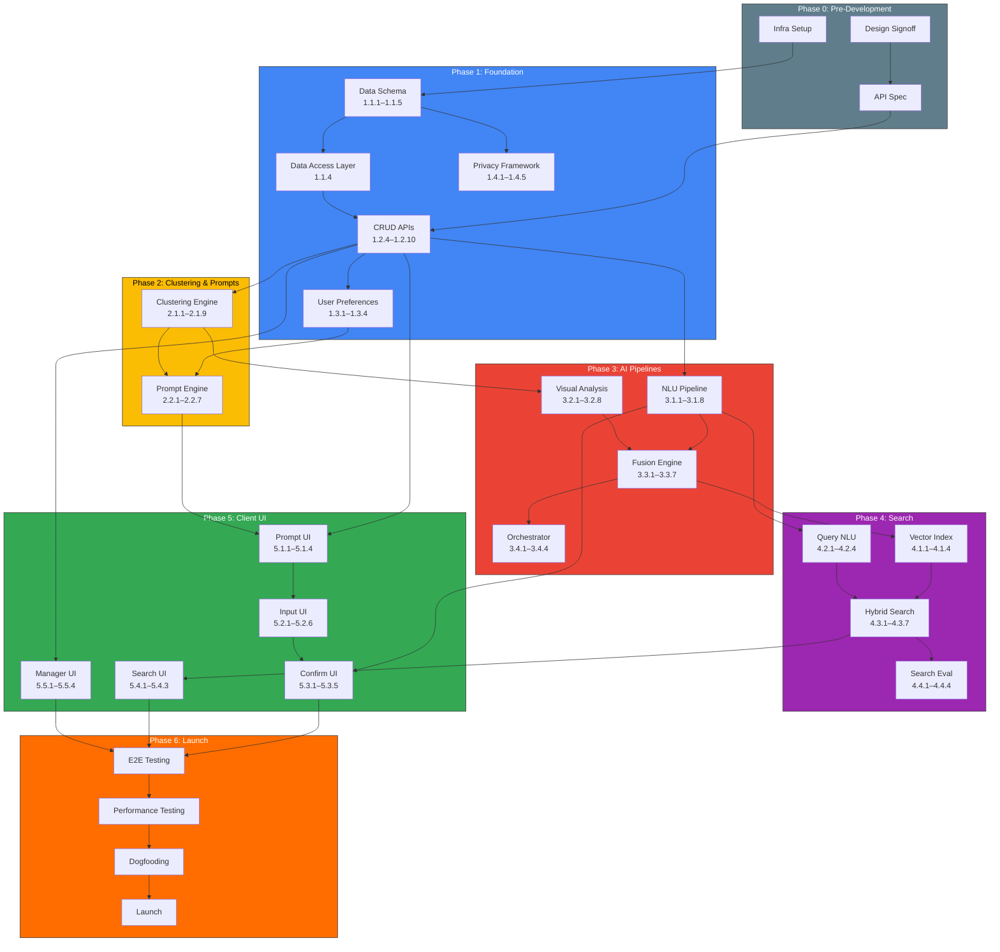

# 📋 Implementation Plan — Google Photos: AI Memory Context MVP

> **A detailed, step-by-step execution plan for building the Memory Context feature from zero to launch.**

---

## Table of Contents

- [Plan Overview](#plan-overview)
- [Team Structure & Roles](#team-structure--roles)
- [Phase 0 — Pre-Development (Week 0)](#phase-0--pre-development-week-0)
- [Phase 1 — Foundation & Data Layer (Weeks 1–4)](#phase-1--foundation--data-layer-weeks-14)
- [Phase 2 — Clustering & Prompt Engine (Weeks 3–6)](#phase-2--clustering--prompt-engine-weeks-36)
- [Phase 3 — AI Pipelines (Weeks 5–8)](#phase-3--ai-pipelines-weeks-58)
- [Phase 4 — Search & Retrieval (Weeks 7–10)](#phase-4--search--retrieval-weeks-710)
- [Phase 5 — Client Integration & UI (Weeks 6–10)](#phase-5--client-integration--ui-weeks-610)
- [Phase 6 — Testing, Polish & Launch (Weeks 9–12)](#phase-6--testing-polish--launch-weeks-912)
- [Detailed Task Breakdown](#detailed-task-breakdown)
- [Dependency Graph](#dependency-graph)
- [Sprint Plan (Week-by-Week)](#sprint-plan-week-by-week)
- [Testing Strategy](#testing-strategy)
- [Launch Checklist](#launch-checklist)
- [Risk Register & Contingencies](#risk-register--contingencies)
- [Success Metrics & Measurement Plan](#success-metrics--measurement-plan)

---

## Plan Overview

### Timeline Summary

```
Week:  0    1    2    3    4    5    6    7    8    9    10   11   12
       ├────┼────┼────┼────┼────┼────┼────┼────┼────┼────┼────┼────┤
Pre-Dev ████
Phase 1      ████████████████████
Phase 2                ████████████████████
Phase 3                          ████████████████████
Phase 4                                    ████████████████████
Phase 5                               ████████████████████████
Phase 6                                              ████████████████
       ────────────────────────────────────────────────────────────────
       Setup  Data+API   Cluster+Prompt  AI Pipes  Search   Polish
```

### Milestones

| Milestone | Target Week | Gate Criteria |
|---|---|---|
| **M0 — Kickoff Complete** | Week 0 | Team assembled, infra provisioned, design specs signed off |
| **M1 — Data Layer Ready** | Week 4 | Memory Store + API CRUD operational, privacy framework live |
| **M2 — Clustering & Prompts Working** | Week 6 | Photo clusters detected, prompts shown to internal testers |
| **M3 — AI Pipeline End-to-End** | Week 8 | User text → structured extraction → fused memory → stored |
| **M4 — Search Functional** | Week 10 | Memory-based queries return relevant photos |
| **M5 — MVP Feature Complete** | Week 11 | Full user journey working end-to-end on all platforms |
| **M6 — Launch Ready** | Week 12 | All tests pass, performance meets SLOs, launch review approved |

---

## Team Structure & Roles

| Role | Count | Responsibilities |
|---|---|---|
| **Tech Lead** | 1 | Architecture decisions, cross-team coordination, code reviews |
| **Backend Engineers** | 3 | API services, orchestrator, data layer, privacy framework |
| **ML Engineers** | 2 | NLU pipeline, visual analysis integration, fusion engine, embedding generation |
| **Search Engineer** | 1 | Vector index, hybrid search, ranking, query understanding |
| **Android Engineer** | 1 | Android client — prompt UI, memory input, search results |
| **iOS Engineer** | 1 | iOS client — prompt UI, memory input, search results |
| **Web Engineer** | 1 | Web client — prompt UI, memory input, search results |
| **UX Designer** | 1 | Interaction design, prototypes, usability testing |
| **Product Manager** | 1 | Requirements, prioritization, launch coordination |
| **QA Engineer** | 1 | Test strategy, automation, regression testing |
| **SRE / DevOps** | 1 | Infrastructure, CI/CD, monitoring, incident response |

---

## Phase 0 — Pre-Development (Week 0)

> **Goal:** Ensure the team has everything needed before writing production code.

### Step 0.1 — Design Review & Signoff

| Task | Owner | Deliverable | Duration |
|---|---|---|---|
| Review [problem statement](file:///Users/shubhamthakur/Downloads/nextleap%20antigravity%20projects/Google%20Photos%20Project%20/MVP%20google%20photos%20/problemStatement.md) with full team | PM | Shared understanding doc | 1 day |
| Review [architecture](file:///Users/shubhamthakur/Downloads/nextleap%20antigravity%20projects/Google%20Photos%20Project%20/MVP%20google%20photos%20/architecture.md) with engineering | Tech Lead | Architecture decision records | 1 day |
| UX design review — prompt flow, memory input, confirmation, search | UX Designer | Approved Figma mockups | 2 days |
| API contract review with client teams | Tech Lead + Client Engineers | Signed-off API spec (OpenAPI) | 1 day |
| Privacy & legal review of data handling approach | PM + Legal | Privacy assessment document | 2 days |

### Step 0.2 — Infrastructure Setup

| Task | Owner | Deliverable | Duration |
|---|---|---|---|
| Create GCP project for Memory Context service | SRE | Project with IAM roles configured | 0.5 day |
| Provision development Cloud Spanner instance | SRE | Dev database with connection strings | 0.5 day |
| Provision dev Redis (Memorystore) instance | SRE | Cache endpoint available | 0.5 day |
| Set up Vertex AI Matching Engine (dev tier) | SRE + ML Engineer | Vector index endpoint | 1 day |
| Configure Gemini API access with dev quotas | ML Engineer | API keys + provisioned throughput | 0.5 day |
| Set up Cloud Vision API access | ML Engineer | Service account with Vision API enabled | 0.5 day |
| Create CI/CD pipeline (Cloud Build / GitHub Actions) | SRE | Build, test, deploy pipeline | 1 day |
| Set up monitoring dashboards (Cloud Monitoring) | SRE | Basic health dashboard live | 0.5 day |
| Create dev, staging, prod environments | SRE | Environment configs per stage | 1 day |

### Step 0.3 — Repository & Project Setup

| Task | Owner | Deliverable | Duration |
|---|---|---|---|
| Create backend service repository with project structure | Tech Lead | Monorepo or multi-repo with service boundaries |  0.5 day |
| Define code review guidelines and branching strategy | Tech Lead | CONTRIBUTING.md, branch protection rules | 0.5 day |
| Create client-side feature branch for Android/iOS/Web | Client Engineers | Feature branches with feature flags | 0.5 day |
| Set up integration test framework | QA Engineer | Test runner configured, example test passing | 1 day |

> [!TIP]
> **Phase 0 Checklist — Do NOT proceed to Phase 1 until:**
> - [ ] Architecture reviewed and approved
> - [ ] UX designs approved for core flows
> - [ ] API contracts signed off
> - [ ] Infrastructure provisioned and accessible
> - [ ] CI/CD pipeline operational
> - [ ] Privacy assessment completed

---

## Phase 1 — Foundation & Data Layer (Weeks 1–4)

> **Goal:** Build the data foundation — schemas, storage, APIs, privacy, and user preferences.

### Step 1.1 — Data Model Implementation (Week 1)

| # | Task | Owner | Details | Acceptance Criteria |
|---|---|---|---|---|
| 1.1.1 | **Define Cloud Spanner schema for MemoryContext table** | Backend Eng 1 | Implement the MemoryContext schema from [architecture §4.1](file:///Users/shubhamthakur/Downloads/nextleap%20antigravity%20projects/Google%20Photos%20Project%20/MVP%20google%20photos%20/architecture.md). Columns: `memory_id`, `user_id`, `cluster_id`, `created_at`, `updated_at`, `status`, `user_input` (JSON), `extracted_context` (JSON), `summary` (JSON), `embeddings` (BYTES), `media_associations` (JSON), `privacy` (JSON) | Schema deployed to dev Spanner, migrations run successfully |
| 1.1.2 | **Define Cloud Spanner schema for MemoryCluster table** | Backend Eng 1 | Implement the MemoryCluster schema from [architecture §4.2](file:///Users/shubhamthakur/Downloads/nextleap%20antigravity%20projects/Google%20Photos%20Project%20/MVP%20google%20photos%20/architecture.md). Columns: `cluster_id`, `user_id`, `created_at`, `status`, `media_items` (JSON), `clustering_metadata` (JSON), `prompt_history` (JSON) | Schema deployed, test data insertable |
| 1.1.3 | **Define Firestore schema for UserPreferences** | Backend Eng 2 | Implement user preferences from [architecture §4.4](file:///Users/shubhamthakur/Downloads/nextleap%20antigravity%20projects/Google%20Photos%20Project%20/MVP%20google%20photos%20/architecture.md). Document path: `users/{user_id}/memory_settings` | Firestore rules deployed, read/write tested |
| 1.1.4 | **Create data access layer (DAL)** | Backend Eng 1 | Repository pattern for MemoryContext and MemoryCluster CRUD operations. Include transaction support for multi-table operations. | Unit tests pass for all CRUD operations |
| 1.1.5 | **Define SemanticIndex schema** | Search Eng | Design the keyword inverted index structure. Table: `semantic_index` with columns for `index_id`, `memory_id`, `user_id`, `keyword_tokens`, `entity_index`, `metadata_index` | Schema reviewed and approved |

### Step 1.2 — API Scaffolding (Weeks 1–2)

| # | Task | Owner | Details | Acceptance Criteria |
|---|---|---|---|---|
| 1.2.1 | **Set up Cloud Run service with HTTP framework** | Backend Eng 2 | Initialize Cloud Run service (Go or Java). Configure routing, middleware (auth, logging, error handling), health checks. | Health endpoint returns 200, deployed to dev |
| 1.2.2 | **Implement auth middleware** | Backend Eng 2 | OAuth 2.0 token validation. Extract `user_id` from token. Reject unauthorized requests with 401. | Auth passes with valid token, rejects invalid |
| 1.2.3 | **Implement rate limiter** | Backend Eng 2 | Per-user rate limiting using Redis. Default: 100 requests/min for API calls, 10 requests/min for memory creation. | Rate limiting enforced, 429 returned when exceeded |
| 1.2.4 | **Implement `POST /v1/memory/contexts` endpoint (stub)** | Backend Eng 1 | Accept cluster_id + user_text. Validate input. Store raw data to Spanner. Return `202 Accepted` with memory_id. Initially no AI processing — just persist. | Endpoint accepts valid input, stores to DB, returns memory_id |
| 1.2.5 | **Implement `GET /v1/memory/contexts/{memory_id}` endpoint** | Backend Eng 1 | Fetch memory context by ID. Validate user ownership. Return full MemoryContext object. | Returns correct data for valid ID, 404 for invalid, 403 for wrong user |
| 1.2.6 | **Implement `PATCH /v1/memory/contexts/{memory_id}` endpoint** | Backend Eng 1 | Allow editing user_text and triggering re-processing. Validate ownership. Update `updated_at`. | Edit succeeds, updated data persisted |
| 1.2.7 | **Implement `DELETE /v1/memory/contexts/{memory_id}` endpoint** | Backend Eng 1 | Soft-delete: set status to `deleted`. Hard-delete: remove all data including embeddings and index entries. Audit log entry created. | Memory no longer retrievable after delete, audit log written |
| 1.2.8 | **Implement `GET /v1/memory/contexts` (list) endpoint** | Backend Eng 1 | List all active memories for the user. Support pagination (`page_token`, `page_size`). Sort by `created_at` descending. | Pagination works, returns only user's own memories |
| 1.2.9 | **Implement `GET /v1/memory/clusters` endpoint (stub)** | Backend Eng 3 | Return pending clusters for the user. Initially returns mock data until clustering engine is built. | Returns valid JSON, mock clusters for test user |
| 1.2.10 | **Implement `POST /v1/memory/clusters/{id}/dismiss` endpoint** | Backend Eng 3 | Handle "Not Now" (set cooldown) and "Don't Ask Again" (permanent opt-out). Update cluster status and user preferences. | Cluster status updated, preference persisted |

### Step 1.3 — User Preferences & Feature Flags (Week 2)

| # | Task | Owner | Details | Acceptance Criteria |
|---|---|---|---|---|
| 1.3.1 | **Implement `GET /v1/memory/settings` endpoint** | Backend Eng 2 | Read user preferences from Firestore. Return defaults if no preferences exist. | Returns valid settings object, defaults for new users |
| 1.3.2 | **Implement `PUT /v1/memory/settings` endpoint** | Backend Eng 2 | Update user preferences. Validate all fields. Invalidate cached preferences on update. | Settings persisted, cache invalidated |
| 1.3.3 | **Implement feature flag system** | Backend Eng 2 | Feature flags for: `memory_context_enabled`, `prompt_enabled`, `voice_input_enabled`, `screenshot_context_enabled`. Flags controllable per user, per percentage rollout, and globally. | Feature flags toggle behavior correctly |
| 1.3.4 | **Implement settings cache** | Backend Eng 2 | Cache user preferences in Redis with 5-minute TTL. Invalidate on settings update. | Cache hit reduces Firestore reads, TTL works |

### Step 1.4 — Privacy & Consent Framework (Weeks 2–4)

| # | Task | Owner | Details | Acceptance Criteria |
|---|---|---|---|---|
| 1.4.1 | **Implement consent manager service** | Backend Eng 3 | Check consent before any memory processing. Track consent state per user. Support consent grant/revoke. Consent check on every API call that processes user data. | No data processed without consent, consent state persisted |
| 1.4.2 | **Implement audit logging** | Backend Eng 3 | Log all memory lifecycle events: create, read, edit, delete, consent change. Logs stored in Cloud Audit Logs. Include `user_id`, `action`, `timestamp`, `resource_id`. **Never log raw memory text.** | Audit logs generated for all lifecycle events |
| 1.4.3 | **Implement encryption-at-rest for memory store** | Backend Eng 3 + SRE | Enable Cloud Spanner encryption with CMEK (Customer-Managed Encryption Keys). Verify data is encrypted at rest. | Encryption verified, keys managed via KMS |
| 1.4.4 | **Implement data deletion pipeline** | Backend Eng 3 | When user deletes a memory: remove MemoryContext row, remove embeddings from vector index, remove entries from keyword index, create audit log entry. Support bulk delete (delete all memories for a user). | Full cascade deletion verified, no orphaned data |
| 1.4.5 | **Implement source labeling** | Backend Eng 1 | Every extracted concept tagged with `source: "user"`, `source: "visual_inferred"`, or `source: "metadata"`. This distinction persists through storage and is exposed in API responses. | Source labels present on all stored concepts |

> [!IMPORTANT]
> **Phase 1 Gate — Week 4 Milestone Check:**
> - [ ] All CRUD APIs operational and tested
> - [ ] Memory Store (Spanner) tables deployed
> - [ ] User preferences read/write working
> - [ ] Privacy consent checks enforced on all endpoints
> - [ ] Audit logging operational
> - [ ] Encryption at rest verified
> - [ ] Feature flags controlling rollout
> - [ ] 80%+ unit test coverage on data layer

---

## Phase 2 — Clustering & Prompt Engine (Weeks 3–6)

> **Goal:** Detect meaningful photo clusters and intelligently prompt users to add memory context.

### Step 2.1 — Memory Clustering Engine (Weeks 3–4)

| # | Task | Owner | Details | Acceptance Criteria |
|---|---|---|---|---|
| 2.1.1 | **Implement photo metadata ingestion** | Backend Eng 3 | Subscribe to Google Photos media sync events (Pub/Sub). On new media sync, extract: `media_id`, `capture_timestamp`, `gps_location`, `device_id`, `media_type` (photo/video/screenshot). | Event handler receives sync events, metadata extracted |
| 2.1.2 | **Implement temporal clustering** | Backend Eng 3 | Group media items captured within a configurable time window (default: 2 hours gap threshold). Sort by timestamp, apply gap-based segmentation. | Photos within 2-hour windows grouped correctly |
| 2.1.3 | **Implement geospatial clustering** | Backend Eng 3 | Within temporal windows, apply DBSCAN clustering with ε = 500m. Merge co-located temporal clusters. Handle missing GPS data gracefully (treat as same location as adjacent photos). | Geo-clustered photos grouped by proximity |
| 2.1.4 | **Implement cluster quality scoring** | Backend Eng 3 | Score each cluster on "memory-worthiness": minimum 3 media items, diversity score (not all identical), media type mix (photos + videos score higher), time span breadth. Score range: 0.0 – 1.0. | Clusters scored, low-quality clusters (e.g., 2 screenshots) filtered out |
| 2.1.5 | **Implement media type classification** | Backend Eng 3 | Classify each media item as: `user_captured_photo`, `user_captured_video`, `screenshot`, `received_image`, `document`. Use metadata heuristics (screen resolution match = screenshot, camera EXIF = captured). | Media types classified with >95% accuracy on test set |
| 2.1.6 | **Implement cluster persistence** | Backend Eng 3 | Save MemoryCluster objects to Spanner. Set status to `pending_prompt`. Include all media items and clustering metadata. | Clusters persisted, retrievable via API |
| 2.1.7 | **Implement background clustering job** | Backend Eng 3 + SRE | Cloud Tasks / Cloud Scheduler job that runs clustering every 4 hours (configurable). Processes new unclustered media since last run. | Job runs on schedule, processes new media, creates clusters |
| 2.1.8 | **Write clustering evaluation dataset** | ML Engineer 1 | Create a dataset of 200+ manually labeled photo groups with expected cluster boundaries. Use for regression testing. | Dataset created with ground truth labels |
| 2.1.9 | **Validate clustering accuracy** | ML Engineer 1 | Run clustering algorithm on evaluation dataset. Measure precision, recall, and F1 for cluster boundary detection. Target: F1 > 0.85. | F1 score meets threshold, report generated |

### Step 2.2 — Notification & Prompt Engine (Weeks 4–6)

| # | Task | Owner | Details | Acceptance Criteria |
|---|---|---|---|---|
| 2.2.1 | **Implement prompt timing service** | Backend Eng 2 | Decision engine that evaluates whether to prompt for a given cluster. Checks: user opt-in, cooldown period (24h default), quiet hours, cluster age (< 48h), cluster quality threshold (> 0.5). | Prompts only generated when all conditions met |
| 2.2.2 | **Implement prompt cooldown tracking** | Backend Eng 2 | Track last prompt time per user in Redis. Enforce minimum gap between prompts. Reset cooldown after successful memory save (user showed engagement). | Cooldown enforced, no duplicate prompts within window |
| 2.2.3 | **Implement dismissal handling** | Backend Eng 2 | "Not Now": apply exponential backoff (next prompt in 48h, then 96h, etc., max 7 days). "Don't Ask Again": set `prompts_enabled = false` in user preferences. | Dismissals handled correctly, backoff applied |
| 2.2.4 | **Implement prompt content generation** | Backend Eng 2 | Generate prompt text dynamically: "Today you captured {n} photos and {m} videos from your {time_of_day}." Use cluster metadata for count and time context. | Prompt text is accurate and contextual |
| 2.2.5 | **Implement push notification delivery** | Backend Eng 2 | Send push notification via FCM (Android) and APNs (iOS) when user is not in-app. Include deep link to prompt flow. Respect notification preferences. | Push notifications delivered on both platforms |
| 2.2.6 | **Implement in-app prompt trigger** | Backend Eng 2 | When user opens Google Photos and has pending clusters, serve prompt data via `GET /v1/memory/clusters`. Client renders the prompt card. | API returns pending prompts, marked as shown after delivery |
| 2.2.7 | **Implement prompt A/B testing hooks** | Backend Eng 2 | Support multiple prompt variants (different copy, timing, triggers). Track variant assignment per user. Log prompt impressions and actions by variant. | A/B test framework records variant exposure and outcome |

> [!NOTE]
> The prompt engine is critical for user experience. Over-prompting causes **prompt fatigue** and opt-outs; under-prompting causes low engagement. Start conservative and iterate based on data.

---

## Phase 3 — AI Pipelines (Weeks 5–8)

> **Goal:** Build the intelligence — NLU extraction, visual analysis, memory fusion, and embedding generation.

### Step 3.1 — NLU Pipeline (Weeks 5–6)

| # | Task | Owner | Details | Acceptance Criteria |
|---|---|---|---|---|
| 3.1.1 | **Design Gemini extraction prompt** | ML Engineer 1 | Craft the system prompt for structured memory extraction. Define output JSON schema. Include few-shot examples covering: people, places, activities, objects, context, temporal refs, emotions. Test against 50+ diverse memory descriptions. | Prompt extracts correct entities on >90% of test cases |
| 3.1.2 | **Implement NLU service wrapper** | ML Engineer 1 | Service that calls Gemini API with the extraction prompt. Handles: input preprocessing (normalization, language detection), API call with retry logic, response parsing and validation, error handling for malformed responses. | Service returns structured MemoryContext from raw text |
| 3.1.3 | **Implement text preprocessing** | ML Engineer 1 | Language detection (using CLD3 or Gemini). Basic text normalization (trim, remove excessive whitespace). Spell correction for common typos (optional, low priority). STT artifact cleanup (remove filler words from voice transcriptions). | Preprocessed text is clean and language-tagged |
| 3.1.4 | **Implement response validation** | ML Engineer 1 | Validate Gemini output against expected JSON schema. Ensure no hallucinated fields. Cross-check: if user didn't mention a person's name, `people[].name` should not contain an invented name. Flag any suspicious extractions. | Validation catches invalid/hallucinated outputs |
| 3.1.5 | **Implement keyword expansion** | ML Engineer 1 | From extracted entities and concepts, generate expanded search keywords. Example: "Ramesh" → also index "friend", "old friend". "Café" → also index "restaurant", "coffee shop". Use Gemini for semantic expansion. | Keywords expanded with related terms, stored in summary |
| 3.1.6 | **Implement NLU output caching** | ML Engineer 1 | Cache NLU results in Redis keyed by hash(user_text). Avoid re-processing identical text (e.g., user saves then edits and reverts). TTL: 1 hour. | Cache hit avoids Gemini API call, cache miss processes normally |
| 3.1.7 | **Build NLU evaluation dataset** | ML Engineer 1 | 200+ labeled memory descriptions with expected structured output. Cover: multiple languages (English, Hindi, Spanish), various memory types (social, travel, product research, work), edge cases (very short text, very long text, ambiguous references). | Dataset created with gold-standard annotations |
| 3.1.8 | **Run NLU quality evaluation** | ML Engineer 1 | Measure entity extraction precision/recall, concept extraction accuracy, hallucination rate (should be <2%). Generate quality report. | Quality report with metrics meeting thresholds |

### Step 3.2 — Visual Analysis Integration (Weeks 5–7)

| # | Task | Owner | Details | Acceptance Criteria |
|---|---|---|---|---|
| 3.2.1 | **Implement visual analysis dispatcher** | ML Engineer 2 | Service that receives a cluster of media items and dispatches them through visual analysis stages. Handles: thumbnail generation (standardized 512px), format normalization, routing photos vs videos. | Dispatcher processes cluster, outputs normalized thumbnails |
| 3.2.2 | **Integrate object detection** | ML Engineer 2 | Call Cloud Vision API or Gemini Vision for object detection on each media item. Extract: object labels, bounding boxes, confidence scores. Filter low-confidence detections (<0.6). | Objects detected per photo with confidence scores |
| 3.2.3 | **Integrate scene classification** | ML Engineer 2 | Classify scenes for each media item: indoor/outdoor, café/restaurant/park/office/home/street, etc. Use existing Google Photos scene model or Gemini Vision multimodal. | Scene labels assigned per photo |
| 3.2.4 | **Integrate face detection and linking** | ML Engineer 2 | Leverage existing Google Photos face detection. For each detected face, retrieve the face group ID (if recognized). Map to known contacts where available. | Faces detected and linked to known face groups |
| 3.2.5 | **Integrate OCR extraction** | ML Engineer 2 | For media items classified as screenshots or documents, run Cloud Vision OCR. Extract text content. Store as structured text blocks. | Text extracted from screenshots with >95% accuracy |
| 3.2.6 | **Implement video keyframe extraction** | ML Engineer 2 | For video media items, extract representative keyframes (1 keyframe per 5 seconds, max 10 per video). Run visual analysis on keyframes. Aggregate results. | Keyframes extracted, analyzed, and results aggregated |
| 3.2.7 | **Implement visual context aggregator** | ML Engineer 2 | Aggregate visual analysis results across all media in a cluster. Deduplicate repeated objects/scenes. Compute confidence-weighted frequency (e.g., "café" detected in 8/10 photos → high confidence). | Aggregated visual context with confidence scores |
| 3.2.8 | **Generate per-media visual embeddings** | ML Engineer 2 | Generate 768-dim embeddings for each media item using CLIP or Gemini multimodal embedding. Store alongside media metadata. | Embeddings generated and stored for all cluster media |

### Step 3.3 — Memory Fusion Engine (Weeks 6–8)

| # | Task | Owner | Details | Acceptance Criteria |
|---|---|---|---|---|
| 3.3.1 | **Implement concept alignment** | ML Engineer 1 | Match user-provided entities against visual detections. Example: user says "café" → visual detects "indoor_restaurant" → align as confirmed match. Use Gemini for semantic similarity between concepts. | Aligned concepts correctly paired user↔visual |
| 3.3.2 | **Implement priority-based merging** | ML Engineer 1 | Merge concepts following priority hierarchy: P0 (user) → P1 (visual confirmed) → P2 (visual supplementary) → P3 (metadata enrichment). Tag each concept with its source. If visual contradicts user, keep user's version as primary. | Merged output respects priority, sources tagged |
| 3.3.3 | **Implement metadata enrichment** | Backend Eng 1 | Enrich memory context with existing photo metadata: resolve GPS to locality name (reverse geocoding), add capture date/time in human-readable format, link to existing albums if applicable. | Metadata enrichments added with source: "metadata" |
| 3.3.4 | **Implement media-level association scoring** | ML Engineer 1 | For each concept in the fused memory, score each media item's relevance. Example: "cake" concept → photo_002 (contains cake) scores 0.95, photo_005 (no cake visible) scores 0.1. Use visual embeddings + object detection results. | Per-media association scores generated and stored |
| 3.3.5 | **Implement fused memory embedding generation** | ML Engineer 1 | Generate a single 768-dim embedding representing the fused memory context. Weighting: 70% user-provided concepts, 20% visual confirmations, 10% metadata. Use text-embedding-005 on the generated keyword string. | Fused embedding generated, dimensionality correct |
| 3.3.6 | **Implement memory summary generation** | ML Engineer 1 | Generate a short (1-sentence) and keyword-chip summary of the fused memory. Short summary: "Meeting Ramesh at a Delhi café — old friends, childhood memories, cake". Keywords: ["Ramesh", "Delhi café", "old friend", "childhood", "cake"]. | Summary is concise, accurate, and human-readable |
| 3.3.7 | **Store complete MemoryContext object** | Backend Eng 1 | Persist the fully fused MemoryContext object to Spanner. Status: `pending_review`. Include all extracted context, embeddings, media associations, and source labels. | Full MemoryContext persisted with all fields populated |

### Step 3.4 — Orchestrator Integration (Weeks 7–8)

| # | Task | Owner | Details | Acceptance Criteria |
|---|---|---|---|---|
| 3.4.1 | **Implement memory creation orchestrator** | Backend Eng 1 | Coordinate the full pipeline: receive user text → call NLU → call Visual Analysis (parallel) → call Fusion → store result → return summary to client. Use saga pattern with compensating actions on failure. | Full pipeline executes in <5s, handles partial failures |
| 3.4.2 | **Implement async processing with status polling** | Backend Eng 1 | `POST /v1/memory/contexts` returns `202 Accepted` immediately. Client polls `GET /v1/memory/contexts/{id}` for status updates. Status progression: `processing` → `pending_review` → `active`. | Client can track processing status via polling |
| 3.4.3 | **Implement partial failure handling** | Backend Eng 1 | If NLU succeeds but Visual fails: save memory with NLU data only, queue visual re-processing. If NLU fails: return error, allow retry. If both fail: return error with "try again later" message. | Partial results saved, degraded gracefully |
| 3.4.4 | **Implement re-processing for edits** | Backend Eng 1 | When user edits memory text via PATCH endpoint: re-run NLU pipeline on new text, re-run fusion with existing visual results (no need to re-analyze photos), update embeddings and index entries. | Edited memory re-processed and re-indexed |

> [!CAUTION]
> **Phase 3 Gate — Week 8 Milestone Check:**
> - [ ] NLU pipeline extracting entities with >90% accuracy
> - [ ] Visual analysis enriching memory context
> - [ ] Fusion engine correctly prioritizing user input
> - [ ] Source labels ("user" vs "visual_inferred") correctly applied
> - [ ] Full pipeline executes end-to-end in <5s
> - [ ] Hallucination rate <2% on evaluation dataset

---

## Phase 4 — Search & Retrieval (Weeks 7–10)

> **Goal:** Enable users to find their photos using memory-based natural language queries.

### Step 4.1 — Vector Index Setup (Weeks 7–8)

| # | Task | Owner | Details | Acceptance Criteria |
|---|---|---|---|---|
| 4.1.1 | **Deploy Vertex AI Matching Engine index** | Search Eng + SRE | Create a Matching Engine index for memory embeddings. Configuration: 768 dimensions, approximate nearest neighbor (ANN), cosine similarity distance, auto-scaling. | Index deployed, accepting upserts |
| 4.1.2 | **Implement embedding upsert pipeline** | Search Eng | When a memory is saved (status → `active`), upsert its embedding to the vector index. When deleted, remove from index. Batch upsert for bulk operations. | Embeddings indexed within 5s of save, removed on delete |
| 4.1.3 | **Implement keyword inverted index** | Search Eng | Build inverted index in Spanner (or Elasticsearch) over memory keywords. Index: person names, place names, activity labels, and expanded keywords. Support exact match and prefix match. | Keyword search returns matching memories |
| 4.1.4 | **Test index performance at scale** | Search Eng | Load test with 100K synthetic memories. Measure: query latency (target: p95 <100ms), upsert latency (target: p95 <200ms), index size growth rate. | Performance meets targets at 100K scale |

### Step 4.2 — Query Understanding (Weeks 8–9)

| # | Task | Owner | Details | Acceptance Criteria |
|---|---|---|---|---|
| 4.2.1 | **Implement query NLU** | Search Eng | Parse user search queries to extract: intent (memory search vs. standard search), entities (people, places, activities), query type (specific recall vs. browsing). Use lightweight Gemini Flash call. | Query entities extracted correctly |
| 4.2.2 | **Implement query embedding generation** | Search Eng | Generate 768-dim embedding for the search query using the same embedding model as memory embeddings (text-embedding-005). Ensure embedding space alignment. | Query embeddings in same space as memory embeddings |
| 4.2.3 | **Implement memory-search intent detection** | Search Eng | Detect whether a query is a memory-based search (→ use memory context system) or a standard search (→ use existing Google Photos search). Heuristic: if query contains personal context ("I", "my", "we", names, emotional words) → memory search. | Intent detection correctly routes >90% of queries |
| 4.2.4 | **Implement query preprocessing** | Search Eng | Normalize query text, extract quoted phrases as exact-match terms, handle typo correction, expand abbreviations. | Preprocessed queries improve search accuracy |

### Step 4.3 — Hybrid Search Implementation (Weeks 8–10)

| # | Task | Owner | Details | Acceptance Criteria |
|---|---|---|---|---|
| 4.3.1 | **Implement vector search** | Search Eng | ANN search over memory embeddings using Vertex AI Matching Engine. Return top-K (default: 20) matching memories with cosine similarity scores. Filter by user_id. | Vector search returns semantically similar memories |
| 4.3.2 | **Implement keyword search** | Search Eng | Exact-match and prefix-match search over the keyword inverted index. Return matching memories with keyword match scores (TF-IDF or BM25 scoring). | Keyword search returns exact matches |
| 4.3.3 | **Implement metadata fallback search** | Search Eng | If memory search returns low-confidence results (<0.3 top score), fall back to existing Google Photos search (date, location, face matching). Blend results. | Fallback triggers on low confidence, blends results |
| 4.3.4 | **Implement score fusion** | Search Eng | Combine scores from vector, keyword, and metadata search using the ranking formula from [architecture §3.7](file:///Users/shubhamthakur/Downloads/nextleap%20antigravity%20projects/Google%20Photos%20Project%20/MVP%20google%20photos%20/architecture.md): `final_score = 0.45×semantic + 0.25×keyword + 0.15×metadata + 0.10×recency + 0.05×quality`. | Fused ranking produces relevant results |
| 4.3.5 | **Implement result deduplication** | Search Eng | If the same photo appears in multiple matched memories, deduplicate. Show the photo once with the highest-scoring memory context. | No duplicate photos in results |
| 4.3.6 | **Implement result expansion** | Search Eng | For each matched memory, expand to include all associated media items. Fetch media metadata and thumbnail URLs from Google Photos storage. | Results include full media list with thumbnails |
| 4.3.7 | **Implement `POST /v1/memory/search` endpoint** | Search Eng + Backend Eng 1 | Complete search endpoint: accept query, run hybrid search, return ranked results with memory context cards. Support pagination. Response includes: media items, relevance scores, matched memory summaries, matched concepts. | Search endpoint returns relevant results in <500ms p95 |

### Step 4.4 — Search Quality Evaluation (Weeks 9–10)

| # | Task | Owner | Details | Acceptance Criteria |
|---|---|---|---|---|
| 4.4.1 | **Build search evaluation dataset** | Search Eng + ML Engineer 1 | Create 100+ (query, expected_results) pairs. Cover: exact name recall ("Ramesh café"), paraphrased queries ("that day with my old friend"), partial recall ("Delhi trip cake"), cross-concept queries ("childhood friends reunion"). | Evaluation dataset with human-judged relevance |
| 4.4.2 | **Run search quality benchmarks** | Search Eng | Measure: Precision@5, Recall@10, MRR (Mean Reciprocal Rank), NDCG@10. Targets: P@5 > 0.7, MRR > 0.6. | Quality metrics meet targets |
| 4.4.3 | **Tune ranking weights** | Search Eng | A/B test different weight configurations for the score fusion formula. Use evaluation dataset as ground truth. Optimize for MRR. | Optimal weights selected and deployed |
| 4.4.4 | **Implement search quality logging** | Search Eng | Log: query text (hashed), matched memory IDs, relevance scores, clicked results, zero-result queries. Use for ongoing quality monitoring. | Logging operational, dashboard shows key metrics |

---

## Phase 5 — Client Integration & UI (Weeks 6–10)

> **Goal:** Build the user-facing experience across Android, iOS, and Web.

### Step 5.1 — Prompt UI (Weeks 6–7)

| # | Task | Owner | Details | Acceptance Criteria |
|---|---|---|---|---|
| 5.1.1 | **Implement Memory Prompt Card (Android)** | Android Eng | Contextual card in the Google Photos timeline. Shows photo cluster preview, prompt text, and three action buttons: "Add Memory", "Not Now", "Don't Ask Again". Matches Google Photos design language. | Card renders correctly, actions trigger correct API calls |
| 5.1.2 | **Implement Memory Prompt Card (iOS)** | iOS Eng | Same card on iOS using SwiftUI. Follow iOS Human Interface Guidelines while maintaining consistency with Android. | Parity with Android, platform-appropriate styling |
| 5.1.3 | **Implement Memory Prompt Card (Web)** | Web Eng | Same card on Web. Responsive design for desktop and tablet. | Parity with mobile, responsive layout |
| 5.1.4 | **Implement push notification handling** | Android Eng + iOS Eng | Handle incoming push notifications. Deep link to the Memory Prompt Card with the relevant cluster loaded. | Tapping notification opens prompt for correct cluster |

### Step 5.2 — Memory Input UI (Weeks 7–8)

| # | Task | Owner | Details | Acceptance Criteria |
|---|---|---|---|---|
| 5.2.1 | **Implement Memory Input Sheet (Android)** | Android Eng | Bottom sheet with: photo cluster preview strip (scrollable thumbnails), text input field with placeholder ("Tell us a little about these photos..."), voice input button, character counter, submit button. | Sheet opens, text/voice input accepted, submit triggers API call |
| 5.2.2 | **Implement Memory Input Sheet (iOS)** | iOS Eng | Same bottom sheet on iOS. Use native keyboard handling and speech recognition integration. | Parity with Android, native iOS behavior |
| 5.2.3 | **Implement Memory Input Sheet (Web)** | Web Eng | Modal dialog on Web with same fields. Keyboard-friendly with Enter-to-submit. | Parity with mobile, keyboard accessible |
| 5.2.4 | **Implement voice input (Android)** | Android Eng | Tap mic icon → start Cloud STT or on-device STT. Show real-time transcription. User can edit transcribed text before submitting. | Voice input transcribes accurately, text editable |
| 5.2.5 | **Implement voice input (iOS)** | iOS Eng | Same voice input using iOS Speech framework or Cloud STT. | Parity with Android voice input |
| 5.2.6 | **Implement optimistic UI state** | Android Eng + iOS Eng + Web Eng | After user submits, show a loading state: "Understanding your memory..." with a progress indicator. Don't block UI — user can dismiss and continue browsing. | Loading state shown, user not blocked |

### Step 5.3 — Confirmation UI (Weeks 8–9)

| # | Task | Owner | Details | Acceptance Criteria |
|---|---|---|---|---|
| 5.3.1 | **Implement Memory Confirmation View (Android)** | Android Eng | Shows AI-understood concepts as semantic chips (pill-shaped labels). User-provided concepts vs. AI-inferred concepts visually distinguished (different chip style or icon). Two buttons: "Save Memory" and "Edit". | Chips rendered correctly, user/AI sources distinguishable |
| 5.3.2 | **Implement Memory Confirmation View (iOS)** | iOS Eng | Same confirmation view on iOS. | Parity with Android |
| 5.3.3 | **Implement Memory Confirmation View (Web)** | Web Eng | Same confirmation view on Web. | Parity with mobile |
| 5.3.4 | **Implement edit flow** | All Client Engs | Tapping "Edit" returns to the input sheet with the original text. User modifies text and re-submits. Triggers re-processing via PATCH endpoint. | Edit flow works end-to-end, re-processed concepts shown |
| 5.3.5 | **Implement success state** | All Client Engs | After "Save Memory": brief success animation, memory keyword chips shown, "Done" button to dismiss. Memory badge appears on the photo cluster in the timeline. | Success state feels rewarding, badge visible |

### Step 5.4 — Search UI (Weeks 9–10)

| # | Task | Owner | Details | Acceptance Criteria |
|---|---|---|---|---|
| 5.4.1 | **Extend search bar for memory queries** | All Client Engs | Existing search bar now routes memory-intent queries to the new search endpoint. No UI change needed in the search bar itself — just backend routing. | Memory queries hit new search endpoint |
| 5.4.2 | **Implement memory-aware search results** | All Client Engs | When results come from memory search, show a "Memory Context" card above the photo grid: memory summary, keyword chips, matched concepts highlighted. | Memory context card shown above results |
| 5.4.3 | **Implement search result highlighting** | All Client Engs | Highlight which concepts in the memory matched the query. Example: query "Ramesh café" → highlight "Ramesh" and "café" chips in the memory card. | Matched concepts visually highlighted |

### Step 5.5 — Memory Manager UI (Week 10)

| # | Task | Owner | Details | Acceptance Criteria |
|---|---|---|---|---|
| 5.5.1 | **Implement Memory Manager screen** | All Client Engs | Settings sub-screen listing all saved memories. Each memory shows: summary, date created, keyword chips, media count. Tap to expand and see details. | All memories listed, tappable for details |
| 5.5.2 | **Implement memory edit from manager** | All Client Engs | Long-press or swipe to edit a saved memory. Opens the input sheet with existing text, pre-filled. | Edit from manager triggers re-processing |
| 5.5.3 | **Implement memory delete from manager** | All Client Engs | Long-press or swipe to delete. Confirmation dialog: "This will permanently remove this memory context. Your photos will not be affected." | Delete confirmed, memory removed, photos unaffected |
| 5.5.4 | **Implement memory settings UI** | All Client Engs | Settings screen for memory feature: toggle on/off, prompt frequency (less/normal/more), quiet hours, voice input toggle. | All settings functional and persisted |

---

## Phase 6 — Testing, Polish & Launch (Weeks 9–12)

> **Goal:** Ensure quality, performance, and readiness for production launch.

### Step 6.1 — End-to-End Testing (Weeks 9–10)

| # | Task | Owner | Details | Acceptance Criteria |
|---|---|---|---|---|
| 6.1.1 | **Write E2E test: full memory capture flow** | QA Eng | Test: capture photos → clustering detected → prompt shown → user adds memory → AI processes → user confirms → memory saved → visible in memory manager. | E2E test passes on all platforms |
| 6.1.2 | **Write E2E test: full memory search flow** | QA Eng | Test: search with memory query → results returned → memory context card shown → correct photos displayed → user taps photo to view. | E2E search test passes |
| 6.1.3 | **Write E2E test: memory edit flow** | QA Eng | Test: open memory manager → edit a memory → re-processed → updated summary shown → updated search results. | Edit E2E test passes |
| 6.1.4 | **Write E2E test: memory delete flow** | QA Eng | Test: delete a memory → memory removed from manager → no longer appears in search results → photos still exist. | Delete E2E test passes, no orphaned data |
| 6.1.5 | **Write E2E test: privacy flows** | QA Eng | Test: disable feature → no prompts shown → existing memories still accessible. Test: consent revocation → data deletion triggered. | Privacy E2E tests pass |
| 6.1.6 | **Write E2E test: dismissal flows** | QA Eng | Test: "Not Now" → cluster re-prompted after cooldown. "Don't Ask Again" → no more prompts ever. | Dismissal behavior correct |
| 6.1.7 | **Cross-platform consistency testing** | QA Eng | Verify: memory saved on Android appears correctly on iOS and Web. Memory saved via Web searchable on Android. | Cross-platform data consistency verified |

### Step 6.2 — Performance Testing (Weeks 10–11)

| # | Task | Owner | Details | Acceptance Criteria |
|---|---|---|---|---|
| 6.2.1 | **Load test API endpoints** | SRE + QA | Simulate 1000 concurrent users. Measure: API response latency (target: p95 < 300ms for reads, p95 < 5s for memory creation), error rate (target: <0.1%), throughput. | Performance targets met under load |
| 6.2.2 | **Load test search engine** | Search Eng + SRE | Simulate 500 concurrent search queries. Measure: search latency (target: p95 < 500ms), result relevance under load, index performance. | Search performance targets met under load |
| 6.2.3 | **Memory pipeline stress test** | ML Engineer 1 + SRE | Submit 100 memories simultaneously. Verify: all processed within 30s, no data loss, queue management works, Gemini API throttling handled gracefully. | All memories processed, no failures |
| 6.2.4 | **Client performance profiling** | Client Engs | Profile: app startup impact (<100ms added), memory consumption of prompt cards, animation frame rate (60fps), search results rendering time. | No measurable regression in app performance |
| 6.2.5 | **Measure and optimize cold start** | SRE | Measure Cloud Run cold start latency. Optimize: min instances, container size, lazy initialization. Target: cold start <2s. | Cold start within target |

### Step 6.3 — Quality & Polish (Weeks 10–11)

| # | Task | Owner | Details | Acceptance Criteria |
|---|---|---|---|---|
| 6.3.1 | **NLU quality regression testing** | ML Engineer 1 | Run full evaluation dataset through production NLU pipeline. Verify extraction accuracy meets launch bar (>90% entity accuracy, <2% hallucination rate). | Quality metrics meet launch bar |
| 6.3.2 | **Search quality regression testing** | Search Eng | Run full search evaluation dataset. Verify ranking quality meets launch bar (P@5 > 0.7, MRR > 0.6). | Search metrics meet launch bar |
| 6.3.3 | **Accessibility audit** | UX Designer + Client Engs | Verify: screen reader compatibility, color contrast ratios (WCAG AA), touch target sizes (min 48dp), keyboard navigation (Web). | Accessibility audit passes |
| 6.3.4 | **Localization** | Client Engs | Translate all UI strings into top-5 languages. Verify layout doesn't break with longer translated strings. | Localized strings render correctly |
| 6.3.5 | **Error state design & implementation** | UX Designer + Client Engs | Design and implement all error states: network failure during memory save, NLU processing failure, search timeout. Each error has a clear message and retry action. | All error states have designed UI with retry options |
| 6.3.6 | **Animation & micro-interaction polish** | Client Engs | Polish: prompt card entrance animation, memory save success animation, chip appearance animation, loading states. Target: smooth 60fps, <300ms animations. | Animations feel polished and performant |

### Step 6.4 — Dogfooding & Internal Testing (Weeks 11–12)

| # | Task | Owner | Details | Acceptance Criteria |
|---|---|---|---|---|
| 6.4.1 | **Internal dogfood launch** | PM + SRE | Deploy to internal testing group (50–100 Googlers). Feature flag enabled for test population only. | Dogfood population has access to the feature |
| 6.4.2 | **Collect dogfood feedback** | PM | Survey + bug reports from internal testers. Focus on: prompt timing satisfaction, NLU accuracy perception, search result relevance, overall feature value. | Feedback collected, >70% positive sentiment |
| 6.4.3 | **Triage and fix dogfood issues** | Full Team | Prioritize and fix critical issues found during dogfooding. Focus on: data loss bugs (P0), incorrect NLU extraction (P1), UI glitches (P2). | Critical issues fixed, known issues documented |
| 6.4.4 | **Iterate on prompt strategy** | Backend Eng 2 + PM | Based on dogfood data: adjust prompt timing, adjust cooldown periods, test different prompt copy variants. Monitor: prompt acceptance rate target >15%. | Prompt strategy optimized based on real data |

### Step 6.5 — Launch Preparation (Week 12)

| # | Task | Owner | Details | Acceptance Criteria |
|---|---|---|---|---|
| 6.5.1 | **Production infrastructure validation** | SRE | Verify: production Spanner instance sized correctly, production Matching Engine index deployed, production Redis cluster provisioned, monitoring dashboards live, alerting rules configured. | All production infra operational and monitored |
| 6.5.2 | **Launch rollout plan** | PM + SRE | Define: staged rollout percentages (1% → 5% → 25% → 100%), rollout criteria (error rate <1%, latency within SLO), rollback triggers, rollback procedure. | Rollout plan documented and reviewed |
| 6.5.3 | **Runbook creation** | SRE | Create on-call runbooks for: NLU pipeline failures, vector index issues, high error rates, data deletion requests, consent revocation handling. | Runbooks reviewed and accessible to on-call team |
| 6.5.4 | **Privacy final review** | PM + Legal | Final privacy review before launch. Verify: consent flows working, data deletion working, audit logs complete, no unexpected data sharing, privacy policy updated. | Privacy review approved |
| 6.5.5 | **Launch review meeting** | Full Team | Present: feature demo, quality metrics, performance benchmarks, risk assessment, rollout plan. Obtain launch approval from leadership. | Launch approval granted |
| 6.5.6 | **Configure production feature flags** | SRE | Set initial rollout to 1%. Configure monitoring alerts for launch. Prepare for rapid rollback if needed. | Feature flags configured, rollback tested |

---

## Detailed Task Breakdown

### Total Task Count by Phase

| Phase | Tasks | Estimated Person-Days |
|---|---|---|
| **Phase 0** — Pre-Development | 14 | 15 |
| **Phase 1** — Foundation & Data Layer | 20 | 35 |
| **Phase 2** — Clustering & Prompt Engine | 16 | 30 |
| **Phase 3** — AI Pipelines | 22 | 45 |
| **Phase 4** — Search & Retrieval | 15 | 30 |
| **Phase 5** — Client Integration & UI | 20 | 40 |
| **Phase 6** — Testing, Polish & Launch | 22 | 35 |
| **Total** | **129** | **~230 person-days** |

### Task Distribution by Role

| Role | Primary Tasks | Phase Focus |
|---|---|---|
| Backend Eng 1 | Data models, CRUD APIs, orchestrator, fusion storage | 1, 3, 4 |
| Backend Eng 2 | Auth, rate limiting, preferences, prompt engine | 1, 2 |
| Backend Eng 3 | Privacy framework, clustering engine, consent | 1, 2 |
| ML Engineer 1 | NLU pipeline, fusion engine, evaluation | 3 |
| ML Engineer 2 | Visual analysis, embedding generation | 3 |
| Search Engineer | Vector index, keyword index, hybrid search, ranking | 4 |
| Android Engineer | All Android UI surfaces | 5 |
| iOS Engineer | All iOS UI surfaces | 5 |
| Web Engineer | All Web UI surfaces | 5 |
| QA Engineer | E2E tests, performance tests, regression | 6 |
| SRE | Infrastructure, CI/CD, monitoring, launch infra | 0, 6 |

---

## Dependency Graph



---

## Sprint Plan (Week-by-Week)

### Week 1

| Team | Focus | Key Deliverables |
|---|---|---|
| **Backend** | Data models + API scaffold | Spanner schemas deployed, Cloud Run service with health check, auth middleware |
| **ML** | Research & design | Gemini prompt design started, visual pipeline design doc |
| **Client** | UX prep | Review Figma designs, set up feature branches and feature flags |
| **SRE** | Infrastructure | Dev environment fully provisioned |
| **QA** | Test planning | Test strategy document, test framework setup |

### Week 2

| Team | Focus | Key Deliverables |
|---|---|---|
| **Backend** | CRUD APIs + preferences | All CRUD endpoints operational, user preferences working |
| **ML** | Prompt iteration + visual spike | Gemini prompt tested on 50+ examples, Cloud Vision integration spike |
| **Client** | Design implementation start | Component library for memory UI elements |
| **SRE** | CI/CD | Build and deploy pipeline operational |

### Week 3

| Team | Focus | Key Deliverables |
|---|---|---|
| **Backend** | Privacy framework + clustering start | Consent manager live, audit logging, temporal clustering implemented |
| **ML** | NLU service implementation | NLU service wrapper calling Gemini, preprocessing working |
| **Client** | Prompt card implementation | Memory Prompt Card rendering on all platforms |
| **QA** | Unit test coverage | 80%+ coverage on data layer |

### Week 4

| Team | Focus | Key Deliverables |
|---|---|---|
| **Backend** | Clustering complete + quality scoring | Full clustering pipeline with quality scoring, background job running |
| **ML** | NLU validation + visual dispatcher | NLU evaluation dataset created, visual analysis dispatcher working |
| **Client** | Prompt card complete + notification handling | Push notification deep linking working |
| **SRE** | Staging environment | Staging deployed and tested |

> [!IMPORTANT]
> **Week 4 — Milestone M1 Gate Review:** Data layer ready, CRUD APIs operational, privacy framework live.

### Week 5

| Team | Focus | Key Deliverables |
|---|---|---|
| **Backend** | Prompt engine timing + cooldowns | Prompt timing service operational, dismissal handling |
| **ML** | Visual analysis integration | Object detection, scene classification, OCR integrated |
| **Client** | Memory input sheet + voice input | Text and voice input working on Android/iOS |
| **Search** | Vector index setup | Matching Engine deployed with test embeddings |

### Week 6

| Team | Focus | Key Deliverables |
|---|---|---|
| **Backend** | Prompt A/B testing + push notifications | Complete prompt engine with notification delivery |
| **ML** | Fusion engine + embedding generation | Concept alignment, priority-based merging, fused embeddings |
| **Client** | Input sheet complete (all platforms) + Web | Voice input polished, Web input modal |
| **Search** | Keyword index + embedding pipeline | Inverted index operational, upsert pipeline working |

> [!IMPORTANT]
> **Week 6 — Milestone M2 Gate Review:** Clustering detected, prompts shown to internal testers.

### Week 7

| Team | Focus | Key Deliverables |
|---|---|---|
| **Backend** | Orchestrator integration | Full pipeline: text → NLU → visual → fusion → store |
| **ML** | NLU quality evaluation + fusion polish | NLU accuracy validated >90%, fusion source labeling verified |
| **Client** | Confirmation view (all platforms) | AI summary with semantic chips, edit flow |
| **Search** | Query NLU + vector search | Query understanding working, ANN search returning results |

### Week 8

| Team | Focus | Key Deliverables |
|---|---|---|
| **Backend** | Orchestrator error handling + re-processing | Partial failure handling, edit re-processing |
| **ML** | End-to-end AI pipeline testing | Full pipeline tested with real photo clusters |
| **Client** | Success states + memory badges | Save animations, timeline badges |
| **Search** | Hybrid search + score fusion | All three search strategies combined, ranking tuned |

> [!IMPORTANT]
> **Week 8 — Milestone M3 Gate Review:** AI pipeline end-to-end, user text → structured memory → stored.

### Week 9

| Team | Focus | Key Deliverables |
|---|---|---|
| **Backend** | Performance optimization | Caching, batching, latency tuning |
| **ML** | Quality regression testing | Final NLU and fusion quality benchmarks |
| **Client** | Search results UI + memory manager | Memory-aware search results, memory list screen |
| **Search** | Search quality evaluation | Evaluation dataset benchmarked, weights tuned |
| **QA** | E2E test writing | Core E2E flows automated |

### Week 10

| Team | Focus | Key Deliverables |
|---|---|---|
| **Backend** | Bug fixes + edge cases | Handle edge cases from testing |
| **ML** | Model versioning + embedding management | Embedding version tracking, migration plan |
| **Client** | Polish + accessibility + localization | Animations polished, accessibility audit, translations |
| **Search** | Search polish + fallback testing | Metadata fallback tested, zero-result handling |
| **QA** | E2E complete + performance testing | All E2E tests passing, load tests run |

> [!IMPORTANT]
> **Week 10 — Milestone M4 Gate Review:** Memory-based search functional and returning relevant photos.

### Week 11

| Team | Focus | Key Deliverables |
|---|---|---|
| **All** | Dogfooding begins | Feature deployed to internal testers |
| **All** | Bug triage + fixes | Critical issues from dogfood fixed |
| **PM** | Feedback collection | Dogfood survey sent, NPS measured |

### Week 12

| Team | Focus | Key Deliverables |
|---|---|---|
| **All** | Final fixes + launch prep | Remaining dogfood issues fixed |
| **SRE** | Production infra + runbooks | Production validated, runbooks written |
| **PM** | Launch review + rollout | Launch review approved, 1% rollout started |

> [!IMPORTANT]
> **Week 12 — Milestone M6: LAUNCH.** Staged rollout begins at 1%.

---

## Testing Strategy

### Testing Pyramid

```
                    ┌───────────┐
                    │  E2E Tests │   ~30 tests
                    │  (Slow)    │   Full user journeys
                    ├───────────┤
                   │ Integration │   ~100 tests
                   │  Tests      │   API + DB + AI pipeline
                   ├─────────────┤
                  │   Unit Tests  │   ~500+ tests
                  │   (Fast)      │   All business logic
                  └───────────────┘
```

### Test Coverage Requirements

| Component | Min Coverage | Critical Paths |
|---|---|---|
| Data Access Layer | 90% | CRUD operations, cascade deletes, transaction rollbacks |
| API Endpoints | 85% | Auth, validation, error responses, pagination |
| Privacy Framework | 95% | Consent checks, audit logging, data deletion |
| Clustering Engine | 80% | Temporal/spatial clustering, quality scoring |
| Prompt Engine | 85% | Timing rules, cooldown, dismissal handling |
| NLU Pipeline | 80% | Entity extraction, hallucination detection, preprocessing |
| Fusion Engine | 85% | Priority merging, source labeling, conflict resolution |
| Search Engine | 85% | Vector search, keyword search, score fusion, ranking |
| Client UI | 75% | Prompt flow, input flow, confirmation flow, search results |

### Specialized Test Types

| Test Type | Scope | Frequency |
|---|---|---|
| **NLU Evaluation** | 200+ memory descriptions → validate extraction accuracy | Every NLU prompt change |
| **Search Evaluation** | 100+ query-result pairs → validate ranking quality | Every ranking weight change |
| **Clustering Evaluation** | 200+ photo groups → validate cluster boundaries | Every clustering algorithm change |
| **Privacy Smoke Tests** | Consent, deletion, audit → verify no data leakage | Every deploy |
| **Latency Benchmarks** | All critical paths → verify SLO compliance | Weekly + pre-launch |
| **Chaos Testing** | Simulate service failures → verify graceful degradation | Bi-weekly |

---

## Launch Checklist

### Pre-Launch (T-1 week)

- [ ] All E2E tests passing on staging
- [ ] Performance benchmarks within SLO
- [ ] NLU accuracy >90%, hallucination rate <2%
- [ ] Search P@5 >0.7, MRR >0.6
- [ ] Privacy review approved
- [ ] Accessibility audit passed
- [ ] Localization complete for top-5 languages
- [ ] Runbooks created and reviewed
- [ ] Monitoring dashboards live with alerting
- [ ] Rollout plan documented
- [ ] Rollback procedure tested

### Launch Day (T-0)

- [ ] Feature flag set to 1% rollout
- [ ] On-call team briefed and available
- [ ] Monitoring dashboards actively watched
- [ ] Error rate dashboards checked every 30 minutes
- [ ] User feedback channels monitored

### Post-Launch (T+1 day to T+1 week)

- [ ] Error rate remains <1%
- [ ] Latency within SLO (p95 <500ms search, <5s memory creation)
- [ ] No privacy incidents
- [ ] Prompt acceptance rate >10%
- [ ] Expand to 5% if Day 1 metrics are green
- [ ] Expand to 25% if Week 1 metrics are green

### Full Rollout (T+2 weeks to T+4 weeks)

- [ ] Expand to 100% based on progressive metric gates
- [ ] Collect and analyze first cohort of memory-based searches
- [ ] Measure: % of users who successfully find a photo via memory search
- [ ] Plan P1 features based on user feedback

---

## Risk Register & Contingencies

| # | Risk | Impact | Probability | Contingency Plan | Owner |
|---|---|---|---|---|---|
| R1 | **Gemini API instability during launch** | Memory creation fails | Medium | Circuit breaker + queue with retry. Save raw text for later processing. Fallback to simpler extraction (regex-based). | ML Eng 1 |
| R2 | **NLU quality below launch bar** | Poor memory extraction, bad search | Medium | More few-shot examples in prompt. Allow user edits as correction signal. Lower threshold and rely more on keyword search. | ML Eng 1 |
| R3 | **Users don't add memories (low adoption)** | Feature underused | High | A/B test prompt copy and timing. Add value demonstration ("Here's a memory you saved that helped"). Reduce friction further. | PM |
| R4 | **Prompt fatigue → high opt-out rate** | Feature disabled by users | High | Start with very conservative frequency (1 prompt per 3 days). Personalize based on engagement history. | Backend Eng 2 |
| R5 | **Search relevance poor at scale** | Users can't find photos via memory | Medium | Aggressive A/B testing of ranking weights. Manual evaluation cycles. Add "not helpful" feedback button. | Search Eng |
| R6 | **Data deletion latency** | Privacy compliance risk | Low | Pre-build deletion pipeline with guaranteed SLA (<24h). Test cascade deletion thoroughly. | Backend Eng 3 |
| R7 | **Scope creep** | Timeline slip | Medium | Strict P0 scope. Defer all P1/P2 to post-launch. PM gatekeeper for any new requirements. | PM |
| R8 | **Cross-platform inconsistency** | Broken experience on some platforms | Medium | Weekly cross-platform testing. Shared component specs. API contract testing. | QA Eng |

---

## Success Metrics & Measurement Plan

### Primary Metrics (Tracked from Day 1)

| Metric | Definition | Target (Launch) | Target (4 weeks) |
|---|---|---|---|
| **Feature Adoption Rate** | % of eligible users who opt-in to the feature | 10% | 20% |
| **Prompt Acceptance Rate** | % of shown prompts where user taps "Add Memory" | 15% | 20% |
| **Memory Save Rate** | % of started memory inputs that are saved (not abandoned) | 70% | 80% |
| **Memory Edit Rate** | % of AI summaries that users edit before saving | <40% | <30% |
| **Memory Search Success Rate** | % of memory-based searches that return clicked results | 50% | 65% |
| **Zero-Result Search Rate** | % of memory-based searches with no results | <25% | <15% |

### Secondary Metrics (Tracked from Week 2+)

| Metric | Definition | Target |
|---|---|---|
| **Memories per Active User per Month** | Average memories saved by engaged users | 3–5 |
| **Memory Retrieval Rate** | % of saved memories that are later found via search | >30% |
| **Prompt Opt-Out Rate** | % of users who select "Don't Ask Again" | <10% |
| **NPS (Memory Feature)** | Net Promoter Score from in-app survey | >40 |
| **Latency SLO Compliance** | % of requests meeting latency targets | >99.5% |
| **Error Rate** | % of API calls returning 5xx errors | <0.1% |

### Measurement Infrastructure

| Component | Tool | Details |
|---|---|---|
| **Event Logging** | Google Analytics / Firebase Analytics | Log: prompt_shown, prompt_accepted, prompt_dismissed, memory_created, memory_edited, memory_deleted, memory_search, search_result_clicked |
| **Quality Monitoring** | Custom dashboard (Cloud Monitoring) | Track: NLU accuracy (sampled), search relevance (sampled), hallucination detections |
| **Performance Monitoring** | Cloud Trace + Cloud Monitoring | Track: API latencies (p50, p95, p99), pipeline processing times, search latencies |
| **User Feedback** | In-app feedback button + surveys | Collect: qualitative feedback on prompts, NLU quality, search relevance |

---

> [!IMPORTANT]
> This plan is designed for a **12-week execution** from kickoff to 1% launch. The total effort is approximately **230 person-days** across a team of 13. The critical path runs through: **Data Layer → Clustering → NLU Pipeline → Fusion → Vector Index → Hybrid Search → E2E Testing → Launch**.

---

*Implementation plan for Google Photos — AI Memory Context MVP. Derived from the [Problem Statement](file:///Users/shubhamthakur/Downloads/nextleap%20antigravity%20projects/Google%20Photos%20Project%20/MVP%20google%20photos%20/problemStatement.md) and [Architecture](file:///Users/shubhamthakur/Downloads/nextleap%20antigravity%20projects/Google%20Photos%20Project%20/MVP%20google%20photos%20/architecture.md).*
