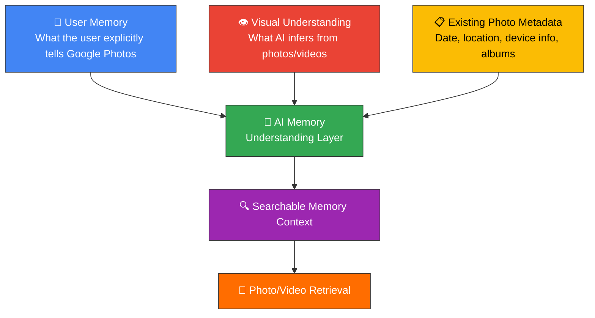
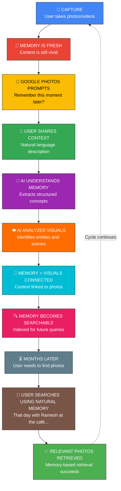

# 🧠 MVP Problem Statement — Google Photos: AI Memory Context

> **"People don't remember photographs. They remember moments."**

---

## Table of Contents

- [Background](#background)
- [The Core Problem](#the-core-problem)
- [MVP Hypothesis](#mvp-hypothesis)
- [The MVP Solution — "Add Memory Context"](#the-mvp-solution--add-memory-context)
  - [Primary Use Case — Photos & Videos](#primary-use-case--photos--videos-captured-by-the-user)
  - [Secondary Use Case — Screenshots & Received Images](#secondary-use-case--screenshots-and-received-images)
- [Core AI Experience](#core-ai-experience)
- [Memory → Search](#memory--search)
- [MVP User Journey](#mvp-user-journey)
- [MVP Scope & Prioritization](#mvp-scope--prioritization)
- [Privacy & Control](#privacy--control)
- [Design Direction](#design-direction)
- [Key Product Principle](#key-product-principle)
- [The Product Loop](#the-product-loop)
- [Success Criteria](#success-criteria-for-the-mvp)
- [The Core Product Insight](#the-core-product-insight)

---

## Background

People capture hundreds or thousands of photos, videos, screenshots, and images every year. However, when they need to find something months later, they often remember the **experience** behind the photo rather than the metadata associated with it.

### What Users Remember vs. What Photo Libraries Store

| 🧠 What Users Remember (Experience) | 📁 What Photo Libraries Store (Metadata) |
|---|---|
| *"I met my old friend at a café in Delhi."* | Exact date |
| *"We had cake and talked about our childhood."* | Exact location / GPS coordinates |
| *"It was a really pleasant sunny day."* | Café name |
| *"We walked towards Rajiv Chowk after leaving the café."* | Filename |
|  | Album name |
|  | Month / timestamp |
|  | Previous search keywords |

> [!IMPORTANT]
> This creates a **fundamental gap** between how humans remember experiences and how digital photo libraries traditionally organize information. A photo library may know *when* and *where* a photo was captured, but the user's strongest memory may be the **PURPOSE**, **CONTEXT**, **EMOTION**, **PEOPLE**, **ACTIVITY**, or **STORY** behind that photo.

---

## The Core Problem

When people try to retrieve an old photo, they search using the information they **currently remember**. But the information they remember may **not exist as searchable context** in their photo library.

### Example Scenario

> A user takes **10 photos and 3 videos** while meeting an old friend at a café in Delhi.
>
> **Six months later**, the user remembers:
>
> *"I met my old friend after several years. We went to a café, had cake, talked about childhood, and then walked towards Rajiv Chowk."*

**What the user does NOT remember:**

- ❌ The exact date
- ❌ The café name
- ❌ The exact location
- ❌ Which photo was taken first
- ❌ What month it was
- ❌ What the file was called

### The Gap

```
┌───────────────────────────────┐         ┌───────────────────────────────┐
│        HUMAN MEMORY           │         │      PHOTO LIBRARY DATA       │
│                               │         │                               │
│  → "What happened?"           │   GAP   │  → "When/where was this       │
│  → Purpose, context, emotion  │ ◄─────► │     photo captured?"          │
│  → People, stories            │         │  → Date, location, filename   │
└───────────────────────────────┘         └───────────────────────────────┘
```

> [!NOTE]
> The user's brain retains the **memory of the experience**, but the photo library has primarily retained the **digital record of the photos**. The MVP should explore whether Google Photos can bridge this gap.

---

## MVP Hypothesis

> **If** Google Photos captures a short natural-language memory/context summary from the user shortly after photos are captured, **then** AI can transform that information into structured, searchable memory context and associate it with the relevant photos and videos.
>
> **Later**, when the user searches using the memory they actually remember, Google Photos can use that contextual information to retrieve the relevant visual memories.

### Example: User Memory → AI Representation

**User says:**

> *"I met my friend Ramesh in a café in Delhi after two years. We talked about our childhood and had cake. It was a sunny day, and later we walked towards Rajiv Chowk."*

**AI generates the following structured representation:**

| Category | Extracted Information |
|---|---|
| **👤 People** | Ramesh |
| **📍 Places** | Café, Delhi, Rajiv Chowk |
| **🏃 Activities** | Meeting a friend, Talking, Eating cake, Walking, Taking the metro |
| **📝 Context** | Meeting an old friend after two years, Childhood memories, Pleasant afternoon |
| **👁️ Visual Signals** | Café, Food/cake, People, Outdoor environment, Metro/walking context |
| **🔑 Memory Keywords** | Old friend, Ramesh, Delhi café, Childhood, Cake, Sunny day, Rajiv Chowk, Catch-up |

The AI then **associates** this contextual representation with the relevant photos and videos.

---

## The MVP Solution — "Add Memory Context"

An AI-powered Google Photos feature that allows users to provide a short contextual description of recently captured or received visual memories.

> [!TIP]
> **Key Principle: CAPTURE THE MEMORY WHILE IT IS FRESH.** The user should not be asked to manually organize every photo. Instead, Google Photos should intelligently identify a meaningful group of recent visual memories and ask the user for a lightweight contextual input.

---

### Primary Use Case — Photos & Videos Captured by the User

> **Priority: P0 (Core MVP)**

When a user captures a meaningful group of photos/videos during the day, Google Photos identifies the cluster and prompts the user at an appropriate time.

#### Notification Example

```
┌─────────────────────────────────────────────────┐
│                                                 │
│  📸  Remember this moment later?                │
│                                                 │
│  Today you captured 10 photos and 3 videos      │
│  from your afternoon. Want to add a little      │
│  context so you can find these memories more     │
│  easily later?                                  │
│                                                 │
│  ┌──────────────┐  ┌──────────┐  ┌────────────┐│
│  │ Add Memory ✨ │  │ Not Now  │  │ Don't Ask  ││
│  └──────────────┘  └──────────┘  │   Again    ││
│                                  └────────────┘│
└─────────────────────────────────────────────────┘
```

| Action | Behavior |
|---|---|
| **Add Memory** | Opens a conversational AI interface for the user to describe the memory |
| **Not Now** | Google Photos continues working normally — no changes |
| **Don't Ask Again** | This feature stops prompting the user entirely |

> [!IMPORTANT]
> The experience must be **completely optional** at every step.

#### Conversational AI Flow

**Prompt:** *"Tell us a little about these photos."*

**User responds:**

> *"I met my friend Ramesh at a café in Delhi after two years. We talked about our childhood, had cake, and later walked towards Rajiv Chowk."*

#### What the AI Does

1. **Understand** the natural-language description
2. **Analyze** the associated photos/videos
3. **Identify** relevant visual entities and scenes
4. **Extract** people, places, activities, objects, events, and contextual concepts
5. **Combine** user-provided context with visual understanding
6. **Create** a concise memory summary
7. **Generate** useful semantic keywords/concepts
8. **Associate** the memory context with the relevant photo/video cluster
9. **Map** specific concepts to individual photos/videos where appropriate

#### Confirmation Screen

```
┌─────────────────────────────────────────────────┐
│                                                 │
│  ✅  Here's what I understood:                  │
│                                                 │
│  Ramesh • Delhi café • Old friends •            │
│  Childhood memories • Cake • Sunny afternoon •  │
│  Rajiv Chowk                                    │
│                                                 │
│       ┌────────────────┐  ┌──────────┐          │
│       │ Save Memory 💾 │  │  Edit ✏️  │          │
│       └────────────────┘  └──────────┘          │
│                                                 │
└─────────────────────────────────────────────────┘
```

> [!CAUTION]
> - The AI should **never silently invent personal facts**.
> - User-provided information must be treated as the **primary source** of personal context.
> - AI-generated visual information must be **clearly distinguishable** from user-provided information.

---

### Secondary Use Case — Screenshots and Received Images

> **Priority: P1**

Screenshots and received images should not trigger the same frequency of prompts as personally captured photos. Instead, Google Photos waits until a **meaningful group** has accumulated (e.g., 8–10 screenshots over several days).

#### Example: Screenshot Context

**Prompt:** *"You've saved several screenshots recently. Want to add a little context to help you find them later?"*

**User responds:**

> *"Mostly screenshots of laptops and products I was comparing before buying a new laptop."*

**AI generates:**

| Category | Extracted Information |
|---|---|
| **🎯 Purpose** | Product research, Laptop comparison |
| **📦 Objects** | Laptop, Specifications, Product pages |
| **📝 Context** | Purchase research |
| **🔍 Search Concepts** | Laptop research, New laptop, Product comparison, Specifications |

#### Personally Received Images (P2 / Future)

The MVP may also explore images received from individuals through messaging or social platforms.

> Example: *"Photos sent by Ramesh from our Delhi trip."*

> [!WARNING]
> - This is a **secondary scenario** and must respect privacy and platform permissions.
> - The MVP should **NOT** assume Google Photos can access private messages or social-media content without explicit user permission and appropriate platform access.

---

## Core AI Experience

The AI should behave less like a traditional search box and more like a **memory-understanding layer**. The system combines **three sources of information**:



### 1. 🧠 User Memory — What the User Explicitly Tells Google Photos

- *"I met my college friend."*
- *"We went to a café."*
- *"It was my first day at the new office."*
- *"I was comparing laptops."*
- *"We went on a family trip."*

### 2. 👁️ Visual Understanding — What AI Can Infer from Photos/Videos

- People & faces
- Objects & products
- Places & scenes
- Food & dining
- Text & documents
- Screens & interfaces
- Visual similarity
- Groups of related images

### 3. 📋 Existing Photo Metadata

- Capture date
- Approximate location
- Device metadata
- Existing albums
- Existing recognized entities
- Existing search/index information

> [!IMPORTANT]
> The AI should combine these signals **without allowing inferred information to overwrite explicit user-provided memory**. User context is always the primary source of truth.

---

## Memory → Search

The ultimate purpose of this feature is **retrieval**. Months later, users search using the memories they actually remember:

| User's Search Query | Type of Memory |
|---|---|
| *"Photos from when I met Ramesh after two years"* | People + Context |
| *"Photos where I went to that Delhi café with my old friend"* | Place + People |
| *"That day we had cake and talked about childhood"* | Activity + Context |
| *"Photos from the laptop research I did before buying my laptop"* | Purpose + Activity |

### What the User Should NOT Need to Remember

- ❌ Exact date
- ❌ Exact location
- ❌ Exact filename
- ❌ Album name
- ❌ Exact search keywords

### The Paradigm Shift

```
╔══════════════════════════════════════════╗
║          TRADITIONAL SEARCH             ║
║  "Search by what the photo IS"          ║
║                                         ║
║  ────────────── ▼ ──────────────        ║
║                                         ║
║          MEMORY-BASED SEARCH            ║
║  "Search by what the memory             ║
║   MEANS TO YOU"                         ║
╚══════════════════════════════════════════╝
```

---

## MVP User Journey

```mermaid
graph LR
    S1["📸 Step 1<br/>CAPTURE<br/>User takes photos/videos"] --> S2["🤖 Step 2<br/>AI CLUSTERS<br/>Google Photos identifies<br/>a potential memory cluster"]
    S2 --> S3["🔔 Step 3<br/>PROMPT<br/>Lightweight notification"]
    S3 --> S4["💬 Step 4<br/>USER INPUT<br/>Natural memory via<br/>text or voice"]
    S4 --> S5["🧠 Step 5<br/>AI UNDERSTANDS<br/>Extracts people, places,<br/>activities, context"]
    S5 --> S6["🔗 Step 6<br/>AI CONNECTS<br/>Links memory context<br/>to photos/videos"]
    S6 --> S7["✅ Step 7<br/>USER CONFIRMS<br/>Reviews and saves<br/>the memory"]
    S7 --> S8["🔍 Step 8<br/>FUTURE RETRIEVAL<br/>User searches using<br/>natural memory"]

    style S1 fill:#4285F4,stroke:#333,color:#fff
    style S2 fill:#EA4335,stroke:#333,color:#fff
    style S3 fill:#FBBC04,stroke:#333,color:#000
    style S4 fill:#34A853,stroke:#333,color:#fff
    style S5 fill:#9C27B0,stroke:#333,color:#fff
    style S6 fill:#FF6D00,stroke:#333,color:#fff
    style S7 fill:#00BCD4,stroke:#333,color:#fff
    style S8 fill:#E91E63,stroke:#333,color:#fff
```



### Step-by-Step Breakdown

| Step | Action | Details |
|---|---|---|
| **Step 1** — Capture | User takes photos/videos throughout the day | e.g., 10 photos + 3 videos |
| **Step 2** — AI Clusters | Google Photos recognizes a related group | Photos/videos that likely represent a single event or activity |
| **Step 3** — Lightweight Prompt | Notification at an appropriate time | *"Remember this moment later? Add a little context to today's photos?"* |
| **Step 4** — User Provides Memory | User writes or speaks naturally | Supports both **text** and **voice** input. Voice input is critical for making memory capture extremely low effort. |
| **Step 5** — AI Understands | AI extracts structured information | People, Places, Activities, Objects, Events, Purpose, Context, Temporal references, Relationships, Semantic concepts |
| **Step 6** — AI Connects | System links memory to visuals | Memory summary + Semantic concepts + Photo/video associations |
| **Step 7** — User Confirms | User reviews and saves | e.g., *"Memory saved — Ramesh • Delhi café • Childhood • Cake • Old friends"* |
| **Step 8** — Future Retrieval | User searches months later | e.g., *"Ramesh café childhood"* or *"the day I met my old friend after two years"* |

---

## MVP Scope & Prioritization

The MVP focuses on one clear problem:

> **Help users retrieve personally captured photos and videos using the contextual memory they remember later.**

| Priority | Scope | Features |
|---|---|---|
| **P0 — Core MVP** | User-captured content | Photos captured by the user · Videos captured by the user · Grouped memories/events · Natural-language memory input · AI-generated memory representation · Memory-to-photo association · Memory-based retrieval |
| **P1** | Saved & utility images | Screenshots · Documents · Product research screenshots · Other personally saved images |
| **P2 — Future** | Advanced scenarios | Personally received images · Cross-app/contextual signals · Automatic memory generation without user input · Deeper conversational memory search |

---

## Privacy & Control

> [!CAUTION]
> Because this feature deals with **personal memories**, privacy must be a **first-class** part of the MVP.

### User Controls Required

| Control | Description |
|---|---|
| **Feature toggle** | Whether the feature is enabled at all |
| **Memory management** | Which memories are saved |
| **AI context storage** | Whether AI-generated context is stored |
| **Edit capability** | Whether a memory can be edited after saving |
| **Delete capability** | Whether a memory can be permanently deleted |
| **Prompt toggle** | Whether prompting/notifications are enabled |
| **Prompt frequency** | How frequently Google Photos asks |

### AI Transparency Rules

- The system must **avoid** creating unnecessary sensitive inferences
- The AI must **clearly distinguish**:

```
┌────────────────────────────────┐      ┌────────────────────────────────┐
│    USER-PROVIDED CONTEXT       │  vs  │     AI-INFERRED CONTEXT        │
│                                │      │                                │
│  What the user explicitly      │      │  What the AI derived from      │
│  told Google Photos            │      │  visual/metadata analysis      │
└────────────────────────────────┘      └────────────────────────────────┘
```

> [!WARNING]
> The MVP should **not** claim to know something simply because an image model inferred it.

---

## Design Direction

The feature must look and feel like a **native Google Photos capability** — not a separate AI application.

### Design Principles

| Principle | Guideline |
|---|---|
| **Familiar** | Use existing Google Photos visual language and interaction patterns |
| **Minimal** | Keep the interface clean and uncluttered |
| **Calm** | Avoid overwhelming the user with AI complexity |
| **Personal** | Make the experience feel intimate and meaningful |
| **Trustworthy** | Build confidence through transparency and user control |
| **AI-natural** | AI-powered without feeling overly technical |

### The Right Feeling

> *"Google Photos quietly helping me remember my own memories."*

AI should appear naturally through:
- Conversational prompts
- Intelligent suggestions
- Semantic chips
- Contextual summaries

> [!WARNING]
> **Do NOT** create a generic futuristic AI dashboard. The MVP must demonstrate a high-quality AI experience while maintaining the simplicity expected from Google Photos.

---

## Key Product Principle

> The feature is **NOT** designed to make users organize their photo library manually.
>
> It is designed to **capture a small amount of human memory at the right moment** so that AI can do the organizational work.

| Role | Responsibility |
|---|---|
| **👤 The User** | Provides the **meaning** |
| **🤖 AI** | Provides the **understanding and organization** |
| **📸 Google Photos** | Provides the **retrieval** |

---

## The Product Loop



---

## Success Criteria for the MVP

The MVP should demonstrate that:

| # | Criterion | What It Validates |
|---|---|---|
| 1 | Users can easily **add contextual memory** to a group of photos/videos | Ease of input |
| 2 | Users can express memories **naturally** rather than using predefined metadata | Natural language UX |
| 3 | AI can **transform** natural-language memory into useful searchable concepts | AI understanding |
| 4 | AI can **connect** contextual information with the relevant photos/videos | Memory-to-visual linking |
| 5 | Users can later **retrieve** those photos using memory-based queries | End-to-end retrieval |
| 6 | The interaction requires **minimal manual effort** | Low friction |
| 7 | The feature feels **native** to Google Photos | Design integration |
| 8 | Users remain in **control** of what memory context is saved | Privacy & trust |

---

## The Core Product Insight

> [!IMPORTANT]
> People do not always remember **photographs**.
>
> They remember **moments**. They remember **people**. They remember **places**. They remember **conversations**. They remember **why something mattered**. They remember **what happened around the photo**.

The MVP explores whether Google Photos can **capture that human context while it is still fresh** and attach it to the visual memory **before the details disappear**.

### The Fundamental Shift

```
╔═════════════════════════════════════════════════════════════╗
║                                                             ║
║   FROM:  "Help me search my photos."                        ║
║                                                             ║
║   ─────────────────────── ▼ ───────────────────────         ║
║                                                             ║
║   TO:    "Help me find the photo using the                  ║
║           memory I still have."                             ║
║                                                             ║
╚═════════════════════════════════════════════════════════════╝
```

---

*Document generated from the original MVP problem statement for Google Photos — AI Memory Context.*
